# 环境部署
## 修改Host文件
添加以下条目
```txt
# 以管理员权限修改host文件 (C:\Windows\System32\drivers\etc):
127.0.0.1    localhost
127.0.0.1    localhost.local-abp3.alvanon.com  # a3前端
127.0.0.1    localhost.local-abp.alvanon.com   # abp前端
127.0.0.1    api.local-abp3.alvanon.com        # a3后端
127.0.0.1    api.local-abp.alvanon.com         # abp后端
```

## 安装Ubuntu24.04
1. 进入 控制面板--程序--程序和功能--启用或关闭Windows功能
2. 勾选【适用于Linux的Windows子系统】，如果要同步使用VMware等虚拟平台则需要勾选【虚拟机平台】
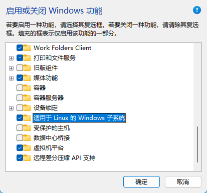

完成后在cmd中执行
```bash
wsl --version
```

可见WSL版本则安装完成

然后执行安装Ubuntu-24.04
```bash
wsl --install Ubuntu-24.04
```

安装完成后可以使用命令进入虚拟机
```bash
wsl -d Ubuntu-24.04
```

也可打开终端 → 下拉箭头 → 设置 → 下滑找到Ubuntu-24.04 → 关闭从下拉菜单中隐藏 → 保存
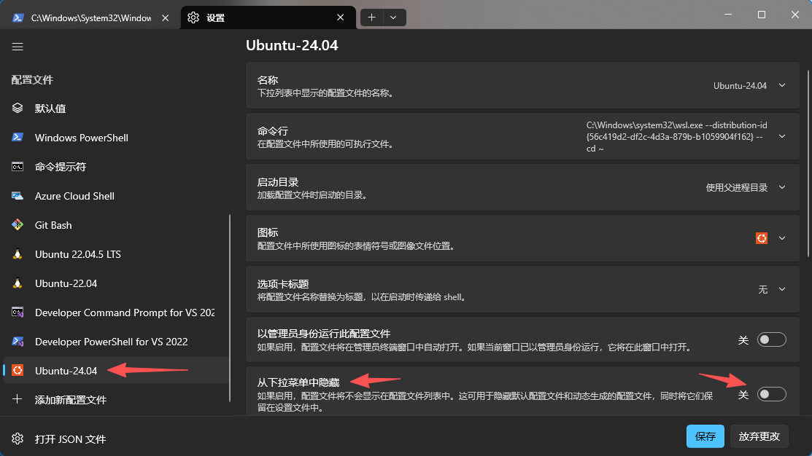

此后可以通过终端直接进入虚拟机命令行
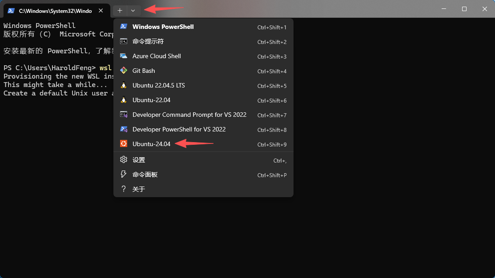

初次进入后按照提示设置用户名与密码
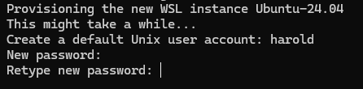


## 安装依赖
24.04自带了python3.12，无需特别安装python

1. 更换源
```bash
sudo apt-get update \
&& sudo apt-get install -y software-properties-common \
&& sudo add-apt-repository -y ppa:deadsnakes/ppa \
&& sudo apt-get update
```

2. 安装基础依赖
```bash
sudo apt-get install -y \
build-essential \
libssl-dev \
libcurl4-openssl-dev \
libpq-dev \
cron \
nginx
```

3. 安装python相关依赖
```bash
sudo apt-get install -y \
python3-pip \
python3.12-venv \
python3.12-dev \
python3-testresources \
pipx \
&& pipx ensurepath
```

重新打开终端窗口，确保pipx的环境变量加载到系统`PATH`中

4. 安装环境管理工具pipenv
```bash
pipx install pipenv
```

## 生成SSH密钥
在本机（Windows）执行
```bash
ssh-keygen -t ed25519 -C "your_email@example.com"  #⭐优先选用ed25519

ssh-keygen -t rsa -b 4096 -C "your_email@example.com"
```

然后打开Ubuntu（WSL），将本机上生成的密钥对复制到WSL中
```bash
cp /mnt/c/Users/<your_username>/.ssh/id_* ~/.ssh/

cd ~/.ssh && chmod 600 id_*
```

## Bitbucket设置
添加公钥
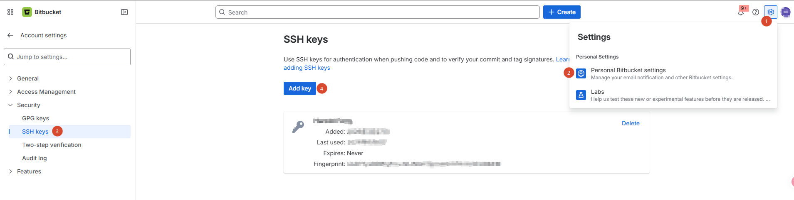

在WSL执行
```bash
ssh -T git@bitbucket.org
```
能看到
>authenticated via ssh key.
>
>You can use git to connect to Bitbucket. Shell access is disabled

## 克隆项目
以A3为例
```bash
git clone git@bitbucket.org:alvanon/alvanon-backend-3.git
```

进入项目根目录
```txt
harold@AVSZ0032:~$ cd alvanon-backend-3/
harold@AVSZ0032:~/alvanon-backend-3$ ls
Dockerfile  Pipfile.lock  alva_platform_center  master.cron.env   rsyslog
Pipfile     README.md     crons                 requirements.txt  staging.cron.env
```

使用pipenv安装依赖
```bash
pipenv install
```

```txt
Creating a virtualenv for this project
Pipfile: /home/harold/alvanon-backend-3/Pipfile
Using /usr/bin/python3 3.12.3 to create virtualenv...
⠴ Creating virtual environment...created virtual environment CPython3.12.3.final.0-64-x86_64 in 412ms
  creator CPython3Posix(dest=/home/harold/.local/share/virtualenvs/alvanon-backend-3-zjmrMWgJ, clear=False,
no_vcs_ignore=False, global=False)
  seeder FromAppData(download=False, pip=bundle, via=copy, app_data_dir=/home/harold/.cache/virtualenv)
    added seed packages: pip==26.1.1
  activators
BashActivator,CShellActivator,FishActivator,NushellActivator,PowerShellActivator,PythonActivator,XonshActiva
tor
✔ Successfully created virtual environment!
Virtualenv location: /home/harold/.local/share/virtualenvs/alvanon-backend-3-zjmrMWgJ
To activate this project's virtualenv, run pipenv shell.
Alternatively, run a command inside the virtualenv with pipenv run.
Installing dependencies from Pipfile.lock (984127)...
```

记得上面给出的虚拟环境路径，一会要用，如果不记得回到项目根目录下执行此命令，会重新显示
```
pipenv --venv
```

至此，环境配置已完成。

# 项目运行
## Pycharm（专业版）
仅专业版才允许使用WSL远程连接，是否需要使用Pycharm请酌情考虑。

### 添加项目
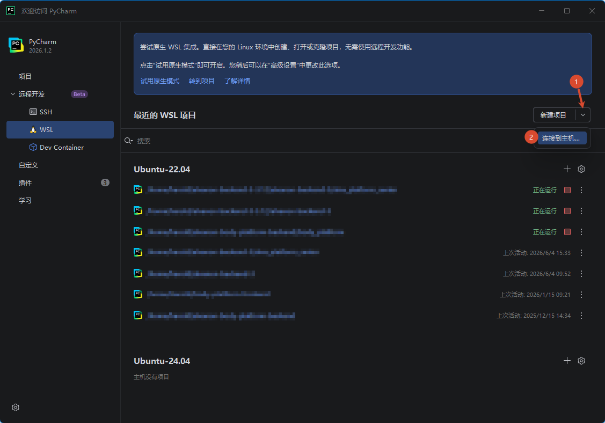

选择Ubuntu24.04
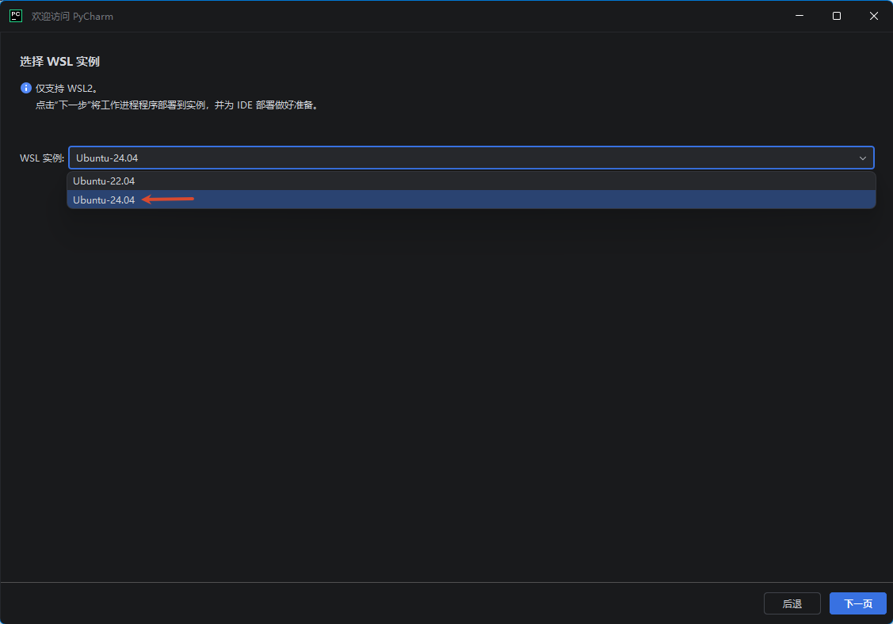

在24.04下添加项目
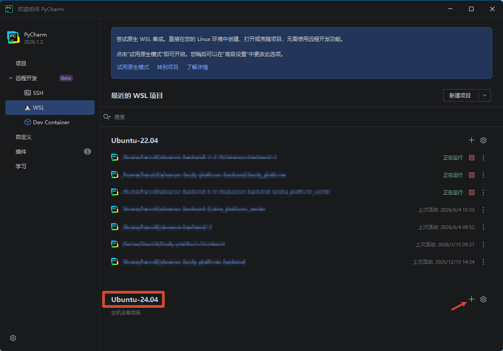

建议选择项目根目录下的项目目录
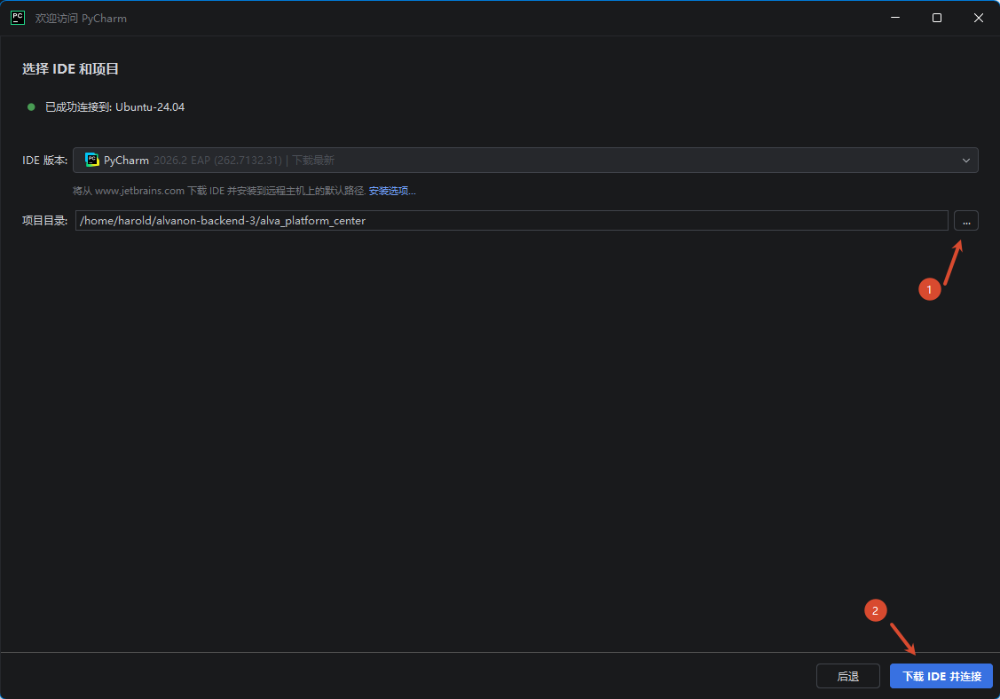

初次启动会在WSL中下载Pycharm客户端，速度较慢

### 配置Django支持
等待完成后，完成以下设置
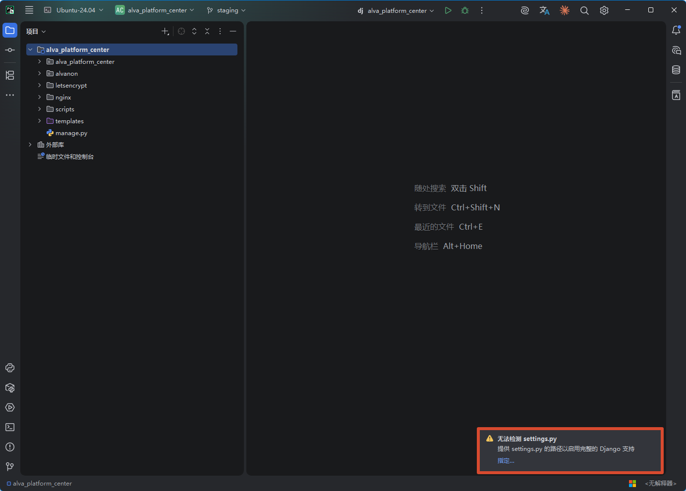

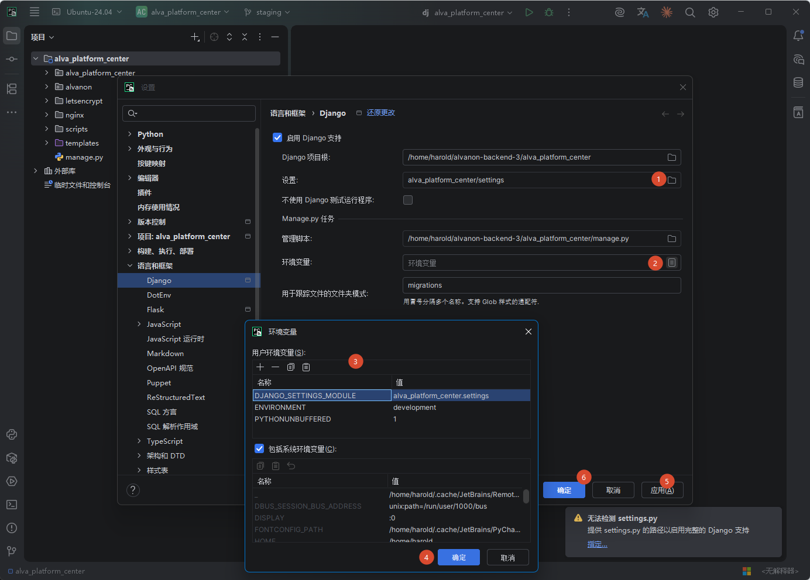

1. 设置settings文件夹
2. 配置环境变量
	- DJANGO_SETTINGS_MODULE=alva_platform_center.settings
	- ENVIRONMENT=development

### 配置解释器


## VSCode、Cursor


# PostgreSQL
本项不是必须的，只有当你需要在本机起PG的测试数据库才需要，通常直接使用staging数据库即可。

```bash
sudo apt-get install -y postgresql postgresql-client
```

