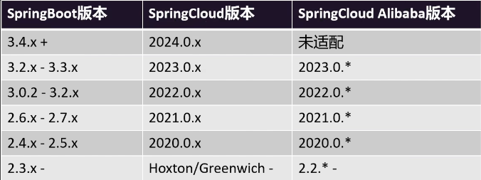
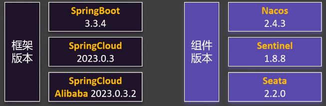

Nacos的主要作用是作为注册中心和配置中心使用
**注册中心：** 即服务的注册和发现，主要为以下几个关键步骤
1. 服务注册：当微服务启动时，它会通过客户端向Nacos注册中心发送注册请求，注册请求中包含服务的信息，如服务名、IP地址、端口号等。这些信息会被保存在服务端的数据库中。
2. 服务发现：当一个微服务需要调用其他微服务时，它会向Nacos注册中心发送请求获取其他服务的信息。Nacos本身并不直接提供服务连接功能，而是通过返回的服务信息，如IP地址和端口号，帮助微服务找到目标服务。
3. 健康检查：Nacos客户端会周期性地向服务实例发送心跳请求，用于检测服务实例的健康状态。如果一个服务实例长时间没有接收到来自客户端的心跳请求，Nacos会将该实例标记为不可用状态。
4. 数据模型：Nacos采用服务-集群-实例的三层模型来存储和管理服务数据。这种模型支持服务级别的权限规则、开关以及实例级别的健康状态、权重等属性。Nacos的数据模型设计考虑到了数据的隔离和安全，以及云上部署的需求。
5. 集群和高可用：Nacos支持集群部署和高可用性，多个节点之间共享注册信息和配置信息，并能够自动进行故障切换，以保证服务的可用性。
6. 配置管理：服务端可以添加服务配置，并通过客户端查询配置API来获取最新的配置信息。客户端还可以通过Nacos的配置同步功能来更新本地服务的配置。

**配置中心：** 主要目的是为了统一管理配置文件和实现配置热更新

[下载地址](https://github.com/alibaba/nacos/releases/)
解压后进入目录运行命令`.\nacos\bin> .\startup.cmd -m standalone` （以单例模式）
或添加到IDEA运行配置
默认用户名密码都是`nacos`


在主项目的项目管理中导入依赖
```xml title:pom.xml
<spring-cloud.version>2023.0.3</spring-cloud.version>  
<spring-cloud-alibaba.version>2023.0.3.2</spring-cloud-alibaba.version>

<dependencyManagement>  
    <dependencies>  
        <!-- Spring Cloud-->
        <dependency>
            <groupId>org.springframework.cloud</groupId>
            <artifactId>spring-cloud-dependencies</artifactId>
            <version>${spring-cloud.version}</version>
            <type>pom</type>
            <scope>import</scope>
        </dependency>
        <!-- Spring Cloud Alibaba-->
        <dependency>
            <groupId>com.alibaba.cloud</groupId>
            <artifactId>spring-cloud-alibaba-dependencies</artifactId>
            <version>${spring-cloud-alibaba.version}</version>
            <type>pom</type>
            <scope>import</scope>
        </dependency>
    </dependencies>  
</dependencyManagement>
```


# 配置中心
## 动态获取配置
引入依赖
```xml
<dependency>  
    <groupId>com.alibaba.cloud</groupId>  
    <artifactId>spring-cloud-starter-alibaba-nacos-config</artifactId>  
</dependency>

<!-- 引导文件支持（已不需要） -->
<dependency>  
    <groupId>org.springframework.cloud</groupId>  
    <artifactId>spring-cloud-starter-bootstrap</artifactId>  
</dependency>
```
创建一个配置文件：
```yml title:bootstrap.yml
spring:  
  application:  
    name: service-order  
  cloud:  
    nacos:  
      server-addr: 127.0.0.1:8848  # 这里的地址是配置中心和注册中心公用的，如果需要区分就在config下和discovery下分别配置server-addr
      config:  
        file-extension: yaml  
        namespace: public  
  config:  
    import:  
      - nacos:${spring.application.name}.yml  
      - nacos:ext0.yaml?group=DEFAULT_GROUP

#配置加载的优先级-命名冲突
# 1 基础的和扩展的存在命名冲突 - 以基础的为准
# 2 扩展的之间存在命名冲突 - import中靠下的优先级更高
```

在配置中心添加配置，`DataID`为`应用名.properties(.yml)`，如果有激活环境选择，那么`DataID`为`应用名-环境名.properties(.yml)`，这种是自动导入某个文件的情况。

假如说在不同名称空间（不同环境）下要导入的配置文件都不一样，可以用多文件的写法
```yaml
spring:  
  profiles:  
    active: dev
  cloud:  
    nacos:  
      config:  
        namespace: ${spring.profiles.active:dev}  # 冒号后面是默认值
        import-check:  
          enabled: false  # 如果上面这里默认部分为空会触发导入检查，先禁用
---  
spring:  
  config:  
    import:  
      - nacos:111.yaml  
      - nacos:prod.yaml?group=order  
    activate:  
      on-profile: prod  
---  
spring:  
  config:  
    import:  
      - nacos:222.yaml  
      - nacos:dev.yaml?group=order  
    activate:  
      on-profile: dev  
---  
spring:  
  config:  
    import:  
      - nacos:333.yaml  
      - nacos:test.yaml?group=order  
    activate:  
      on-profile: test
```
又或者使用springboot提供的application-xxx.yml这种来区分配置

然后在需要动态刷新配置的类上添加`@RefreshScope`，配合`@Value(${})`获取某个配置的值
> 如果使用`@ConfigurationProperties`注解绑定，则无需添加`@RefreshScope`也可实现自动刷新

如有冲突，优先使用配置中心的值

### 命名空间
用于配置隔离
默认：public（保留空间），默认新增的所有配置都在public空间
如有开发、生产、测试环境，可创建多个命名空间如：dev、prod、test
也可以每个项目创建一个命名空间，以项目隔离

### 配置分组
默认所有的配置集都属于DEFAULT_GROUP，可以用来标识不同微服务或者多套环境，可以用来指定发布到本机的运行服务中

### 加载多个配置
`spring.cloud.nacos.config.ext-config[0].data-id=xxx` 0自行自增调整
`spring.cloud.nacos.config.ext-config[0].group=xxx` 也可以指定组
`spring.cloud.nacos.config.ext-config[0].refresh=true` 是否自动刷新，默认为false

**总而言之顺序就是 命名空间->分组->配置文件**，具体应该如何分配看公司内部规定即可

### 配置优先级
- userservice-dev.yml（当前环境配置profiles） > userservice.yml（nacos上的）> application.yml（本地的）
- 主配置 > 扩展配置(extension-configs) > 共享配置(shared-configs)。
- 同为扩展配置，存在如下优先级关系：extension-configs[3] > extension-configs[2] > extension-configs[1] > extension-configs[0]。
- 同为共享配置，存在如下优先级关系：shared-configs[3] > shared-configs[2] > shared-configs[1] > shared-configs[0]。


# 注册中心
## 服务注册与发现
在子项目中添加服务发现依赖
```xml title:pom.xml
<dependency>  
    <groupId>com.alibaba.cloud</groupId>  
    <artifactId>spring-cloud-starter-alibaba-nacos-discovery</artifactId>  
</dependency>
```

子项目添加配置
```yml title:application.yml
spring:  
  application:  
    name: service-order  
  cloud:  
    nacos:  
      server-addr: 127.0.0.1:8848
```


对应版本



推荐使用




# 更新说明
在nacos2.4版本以后，官方使用了spring推行的配置路径spring.config.import指定加载外部属性源，且不再使用bootstrap配置文件