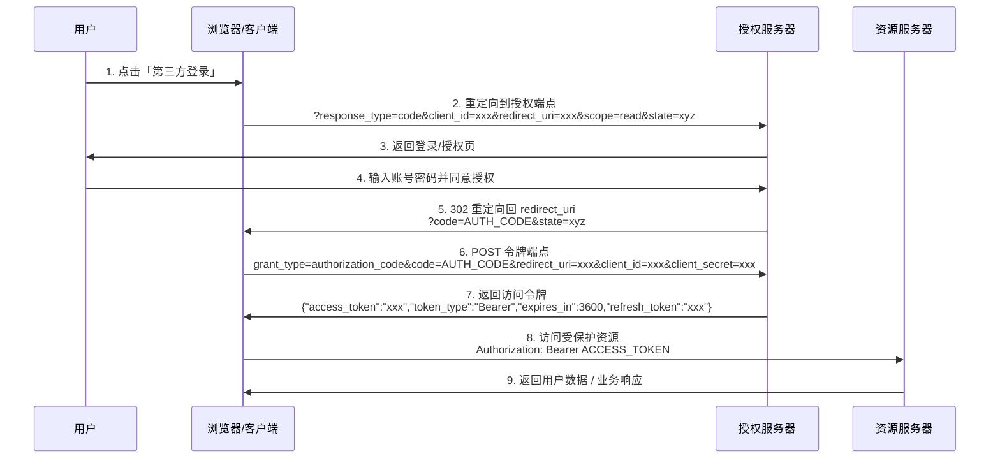

分布式权限校验

# OAuth2.0 定义的角色类型

根据 OAuth 2.0 协议规范，OAuth 2.0体系下有四个角色类型：

- 资源所有者，你的应用的用户是资源的所有者，授权其他人访问他的资源。比如微信用户是资源所有者。
- 调用方，调用方请求获取 Access Token，经过用户授权后，微信开放平台为其颁发 Access Token。调用方可以携带 Access Token 到资源服务器访问用户的资源。比如调用方是网站A或者其他第三方应用。
- 授权服务器，负责颁发 Access Token，比如微信开放平台授权服务器。
- 资源服务器，接受 Access Token，然后验证它的被赋予的权限项目，最后返回资源。比如微信开放平台资源服务器。


# 实现单点登录

主要用于第三方登录，基于第三方应用访问用户信息的能力（本质就是给别人调用自己服务接口的权限）

**四种授权模式：**
1. 客户端模式（client_credentials）
  这是最简单的模式，直接向验证服务器请求一个Token，之后才能访问资源，它可以是任何类型的客户端，App，小程序甚至第三方应用。这种模式比较简便，但是失去了用户验证的意义，更适用于服务内部调用的场景。
2. 密码模式（password）
  相比客户端模式，多了用户名和密码信息，用户需要提供对应账户的用户名和密码才能获取到Token。虽然这样看着比较合理，但是会直接将账号和密码泄露给客户端，需要后台完全信任客户端不会拿账号密码去做其他事情，所以这也不是常见的用法。
3. 隐式授权模式（implicit）
  首先用户访问页面时，会重定向到认证服务器，接着认证服务器给用户一个认证页面，等待用户授权，用户填写信息完成授权后，认证服务器返回Token，它适用于没有服务端的第三方应用页面，相比前面一种形式，认证都是在验证服务器进行的，敏感信息不会轻易泄露，但是Token仍然有泄露风险
4. ==授权码模式==✨（authorization_code）
  这是最安全的模式，也是最推荐的形式。相比隐式授权模式，它并不会直接返回Token，而是返回授权码，真正的Token是通过**应用服务器**访问**验证服务器**获得的。在一开始的时候，**应用服务器**（客户端通过访问自己的应用服务器来进而访问其他服务）和**验证服务器**之间会共享一个`secret`，这个东西没有其他人知道，而**验证服务器**在用户验证完成之后，会返回一个授权码，**应用服务器**最后将授权码和`secret`一起交给验证服务器进行验证，并且Token也是在服务端之间传递，不会直接给到客户端。也就是说新增了一个可信任的应用服务器的角色





1. 浏览器访问服务1时，先看服务1自己的session里面有没有已登录的信息，如果没有，就访问授权服务器的预登录页面查看有没有在授权服务器的已登录信息，如果还是没有再重定向到授权服务器的登录页。
2. 用户登录后将登录信息保存到授权服务器中，再将令牌返回给服务1，服务1拿到令牌之后先通过授权服务器拿到token信息，确认token有效之后将登录信息保存到服务1的session中。再将token返回给用户，用户此后将直接使用token访问服务1。
3. 然后浏览器访问服务2时，也是先看服务2的session中有没有已登录信息，如果没有，就访问授权服务器的预登录页，假设服务1已经在授权服务器登录，此时预登录页面可以获取到授权服务器的已登录信息，则可以直接颁发令牌给服务2。
4. 同样的，服务2拿到令牌之后先通过授权服务器拿到token信息，确认token有效之后将登录信息保存到服务2的session中。再将token返回给用户，用户此后将直接使用token访问服务2。


# JWT

## JWT字段说明

| 缩写          | 全称                                     | 中文解释                                                           |
| ----------- | -------------------------------------- | -------------------------------------------------------------- |
| `iss`       | Issuer 签发机构                            | 表示该 JWT 的签发主体（例如认证服务器的标识）。                                     |
| `sub`       | Subject 主题                             | 表示该 JWT 所面向的用户（通常是用户 ID 或用户名）。                                 |
| `aud`       | Audience 受众                            | 表示该 JWT 的接收方（可以是单个字符串或数组，指定哪些系统可以使用此 JWT）。                     |
| `exp`       | Expiration Time 过期时间                   | 表示该 JWT 的过期时间，必须大于签发时间。                                        |
| `nbf`       | Not Before 生效时间                        | 表示该 JWT 的生效时间，在此时间之前不会被接受。                                     |
| `iat`       | Issued At 签发时间                         | 表示 JWT 的签发时间。                                                  |
| `jti`       | JWT ID 唯一标识                            | 表示 JWT 的唯一标识，用于防止重放攻击（可存数据库做黑名单机制）。                            |
| 以下是扩展字段     |                                        |                                                                |
| `act`       | Actor 代理者                              | 来自 RFC 8693，表示“代表者”（代理执行者）的身份，用于代理/委托场景。                       |
| `cnf`       | Confirmation 确认信息                      | 来自 RFC 7800，用于绑定密钥或其他确认信息（例如绑定到特定设备的公钥）。                       |
| `auth_time` | Authentication Time 认证时间               | 来自 OpenID Connect，表示用户完成认证的时间戳。                                |
| `nonce`     | Nonce 随机数                              | 来自 OpenID Connect，用于防止重放攻击，由客户端生成并由服务端返回，确保请求唯一性。              |
| `azp`       | Authorized Party 授权方                   | 来自 OpenID Connect，表示最终被授权使用 ID Token 的客户端（通常和 `aud` 配合使用）。     |
| `at_hash`   | Access Token Hash                      | 来自 OpenID Connect，表示 Access Token 的哈希值，用于验证 Access Token 的完整性。 |
| `c_hash`    | Code Hash                              | 来自 OpenID Connect，表示授权码的哈希值，用于混合流（Hybrid Flow）校验授权码未被篡改。       |
| `sid`       | Session ID 会话 ID                       | 来自 OpenID Connect，表示用户的会话标识，用于登出管理。                            |
| `acr`       | Authentication Context Class Reference | 来自 OpenID Connect，表示认证等级（如多因素认证、强认证等级）。                        |
| `amr`       | Authentication Methods References      | 来自 OpenID Connect，表示认证方式列表（如密码、指纹、人脸识别等）。                      |


# 授权服务器搭建

**导入Redis依赖**
父项目中导入
```xml title:pom.xml
<dependency>  
    <groupId>org.springframework.cloud</groupId>  
    <artifactId>spring-cloud-dependencies</artifactId>  
    <version>2021.0.1</version>  
    <type>pom</type>  
    <scope>import</scope>  
</dependency>
```
新建auth-service模块，并添加依赖，修改配置文件
```xml title:auth-service/pom.xml
<dependency>  
    <groupId>org.springframework.boot</groupId>  
    <artifactId>spring-boot-starter-web</artifactId>  
</dependency>  
<dependency>  
    <groupId>org.springframework.boot</groupId>  
    <artifactId>spring-boot-starter-security</artifactId>  
</dependency>  
<!-- 这是比较旧的版本，新的版本集成在Spring Security 5中，但是资料比较少 -->
<dependency>  
    <groupId>org.springframework.boot</groupId>  
    <artifactId>spring-cloud-starter-oauth2</artifactId>  
    <version>2.2.5.RELEASE</version>  
</dependency>
```

```yml title:auth-service/application.yml
server:  
  port: 8500  
  servlet:  
    #保存Cookies时的制定路径，不指定会和其他服务冲突，但是后面的请求都要加上这个路径  
    context-path: /sso
```

写两个配置类
```java title:SpringSecurityConfiguration.java
@Configuration  
public class SpringSecurityConfiguration extends WebSecurityConfigurerAdapter {  
    @Override  
    protected void configure(HttpSecurity http) throws Exception {  
        http  
                .authorizeRequests()  
                .anyRequest().authenticated()  
                .and()  
                .formLogin().permitAll();   //使用表单登录  
    }  
  
    @Override  
    protected void configure(AuthenticationManagerBuilder auth) throws Exception {  
        BCryptPasswordEncoder encoder = new BCryptPasswordEncoder();  
        auth  
                .inMemoryAuthentication()   //直接创建一个用户，懒得搞数据库了  
                .passwordEncoder(encoder)  
                .withUser("test").password(encoder.encode("123456")).roles("USER");  
    }  
  
    @Bean   //这里需要将AuthenticationManager注册为Bean，在OAuth配置中使用  
    @Override  
    public AuthenticationManager authenticationManagerBean() throws Exception {  
        return super.authenticationManager();  
    }  
    
	@Bean 
	@Override 
	public UserDetailsService userDetailsServiceBean() throws Exception { 
		return super.userDetailsServiceBean(); 
	}
}
```

```java title:OAuth2Configuration.java
@EnableAuthorizationServer   //开启验证服务器  
@Configuration  
public class OAuth2Configuration extends AuthorizationServerConfigurerAdapter {  
    @Resource  
    private AuthenticationManager manager;  
  
    private final BCryptPasswordEncoder encoder = new BCryptPasswordEncoder();
      
	@Resource  
	UserDetailsService service;
  
    /**  
     * 这个方法是对客户端进行配置，一个验证服务器可以预设很多个客户端，  
     * 之后这些指定的客户端就可以按照下面指定的方式进行验证  
     * @param clients 客户端配置工具  
     */  
    @Override  
    public void configure(ClientDetailsServiceConfigurer clients) throws Exception {  
        clients  
                .inMemory()   //这里直接硬编码创建，当然也可以像Security那样自定义或是使用JDBC从数据库读取  
                .withClient("web")   //客户端名称，随便起就行  
                .secret(encoder.encode("654321"))      //只与客户端分享的secret，随便写，但是注意要加密  
                .autoApprove(false)    //自动审批，这里关闭，要的就是一会体验那种感觉  
                .scopes("book", "user", "borrow")     //授权范围，这里我们使用全部all  
                .authorizedGrantTypes("client_credentials", "password", "implicit", "authorization_code", "refresh_token");  
        //授权模式，一共支持5种，除了之前的四种之外，还有一个刷新Token的模式  
        //现在客户端就支持这五种类型的授权方式  
    }  
  
    @Override  
    public void configure(AuthorizationServerSecurityConfigurer security) {  
        security  
                .passwordEncoder(encoder)    //编码器设定为BCryptPasswordEncoder  
                .allowFormAuthenticationForClients()  //允许客户端使用表单验证，一会POST请求中会携带表单信息  
                .checkTokenAccess("permitAll()");     //允许所有的Token查询请求  
    }  
  
    @Override  
    public void configure(AuthorizationServerEndpointsConfigurer endpoints) {  
        endpoints  
		        .userDetailsService(service)
                .authenticationManager(manager);  
        //由于SpringSecurity新版本的一些底层改动，这里需要配置一下authenticationManager，才能正常使用password模式  
    }  
}
```


# 使用
使用时只需将客户端加上一个注解即可，有两种注解：
- `@EnableOAuth2Sso`
- `@EnableResourceServer`

## 基于@EnableOAuth2Sso实现
依赖：
```xml
<dependency>
    <groupId>org.springframework.boot</groupId>
    <artifactId>spring-boot-starter-security</artifactId>
</dependency>

<dependency>
    <groupId>org.springframework.cloud</groupId>
    <artifactId>spring-cloud-starter-oauth2</artifactId>
    <version>2.2.5.RELEASE</version>
</dependency>
```

只需要直接在启动类上添加即可：
```java
@EnableOAuth2Sso
@SpringBootApplication
public class BookApplication {
    public static void main(String[] args) {
        SpringApplication.run(BookApplication.class, args);
    }
}
```

不需要进行额外的配置类，因为这个注解已经做了：
```java
@Target({ElementType.TYPE})
@Retention(RetentionPolicy.RUNTIME)
@Documented
@EnableOAuth2Client
@EnableConfigurationProperties({OAuth2SsoProperties.class})
@Import({OAuth2SsoDefaultConfiguration.class, OAuth2SsoCustomConfiguration.class, ResourceServerTokenServicesConfiguration.class})
public @interface EnableOAuth2Sso {
}
//可以看到它直接注册了OAuth2SsoDefaultConfiguration，而这个类就是帮助我们对Security进行配置的：

@Configuration
@Conditional({NeedsWebSecurityCondition.class})
public class OAuth2SsoDefaultConfiguration extends WebSecurityConfigurerAdapter {
  	//直接继承的WebSecurityConfigurerAdapter，帮我们把验证设置都写好了
    private final ApplicationContext applicationContext;

    public OAuth2SsoDefaultConfiguration(ApplicationContext applicationContext) {
        this.applicationContext = applicationContext;
    }
}
```

接着在配置文件中配置验证服务器相关信息：
```yml
security:
  oauth2:
    client:
      #客户端id和密钥
      client-id: web
      client-secret: 654321
      #Token获取地址
      access-token-uri: http://localhost:8500/sso/oauth/token
      #验证页面地址
      user-authorization-uri: http://localhost:8500/sso/oauth/authorize
    resource:
      #Token信息获取和校验地址
      token-info-uri: http://localhost:8500/sso/oauth/check_token
```

但是发现一个问题，就是由于SESSION不同步，每次切换不同的服务进行访问都会重新导验证服务器去验证一次
这里有两个方案：
- 像之前一样做SESSION统一存储
- 设置context-path路径，每个服务单独设置，就不会打架了
但是这样依然没法解决服务间调用的问题，所以仅仅依靠单点登陆的模式不太行。


## 基于@EnableResourceServer实现
为资源服务就不会再提供验证的过程，而是直接要求请求时携带Token
加上注解
```java title:BookApplication.java
@EnableResourceServer 
@SpringBootApplication 
public class BookApplication { 
	public static void main(String[] args) { SpringApplication.run(BookApplication.class, args); } 
}
```
配置：
配置中只需要：
```yml title:application.yml
security:
  oauth2:
    client:
      client-id: web
      client-secret: 654321
    resource:
    	#因为资源服务器得验证你的Token是否有访问此资源的权限以及用户信息，所以只需要一个验证地址
      token-info-uri: http://localhost:8500/sso/oauth/check_token
```
访问时有两种方式：
- 在URL后面添加`access_token`请求参数，值为Token值
- 在请求头中添加`Authorization`，值为`Bearer +Token值`

至于这个Token值如何获取，就要看应用如何做单点登录了

对资源服务器进行深度自定义，可以为其编写一个配置类，比如现在希望用户授权了某个Scope才可以访问此服务：
```java
@Configuration
public class ResourceConfiguration extends ResourceServerConfigurerAdapter { //继承此类进行高度自定义

    @Override
    public void configure(HttpSecurity http) throws Exception {  //这里也有HttpSecurity对象，方便我们配置SpringSecurity
        http
                .authorizeRequests()
                .anyRequest().access("#oauth2.hasScope('lbwnb')");  //添加自定义规则
      					//Token必须要有我们自定义scope授权才可以访问此资源
    }
}
```
可以看到当没有对应的scope授权时，那么会直接返回`insufficient_scope`错误
但是还有一个问题没有解决，我们在使用RestTemplate进行服务间的远程调用时，会得到以下错误：


实际上这是因为在服务调用时没有携带Token信息，我们得想个办法把用户传来的Token信息在进行远程调用时也携带上，可以直接使用OAuth2RestTemplate，它会在请求其他服务时携带当前请求的Token信息。它继承自RestTemplate，这里直接定义一个Bean：
```java
@Configuration
public class WebConfiguration {

    @Resource
    OAuth2ClientContext context;

    @Bean
    public OAuth2RestTemplate restTemplate(){
        return new OAuth2RestTemplate(new ClientCredentialsResourceDetails(), context);
    }
}
```
接着我们直接替换掉之前的RestTemplate即可：

```java
@Service
public class BorrowServiceImpl implements BorrowService {

    @Resource
    BorrowMapper mapper;

    @Resource
    OAuth2RestTemplate template;

    @Override
    public UserBorrowDetail getUserBorrowDetailByUid(int uid) {
        List<Borrow> borrow = mapper.getBorrowsByUid(uid);
        User user = template.getForObject("http://localhost:8101/user/"+uid, User.class);
        //获取每一本书的详细信息
        List<Book> bookList = borrow
                .stream()
                .map(b -> template.getForObject("http://localhost:8201/book/"+b.getBid(), Book.class))
                .collect(Collectors.toList());
        return new UserBorrowDetail(user, bookList);
    }
}
```

现在将Nacos加入，并通过Feign实现远程调用。
依赖：
```xml
<dependency>
    <groupId>com.alibaba.cloud</groupId>
    <artifactId>spring-cloud-alibaba-dependencies</artifactId>
    <version>2021.0.1.0</version>
    <type>pom</type>
    <scope>import</scope>
</dependency>
```

```xml
<dependency>
    <groupId>com.alibaba.cloud</groupId>
    <artifactId>spring-cloud-starter-alibaba-nacos-discovery</artifactId>
</dependency>
<dependency>
    <groupId>org.springframework.cloud</groupId>
    <artifactId>spring-cloud-starter-loadbalancer</artifactId>
</dependency>
```

接着配置一下借阅服务的负载均衡：
```java
@Configuration
public class WebConfiguration {

    @Resource
    OAuth2ClientContext context;

    @LoadBalanced   //和RestTemplate一样直接添加注解就行了
    @Bean
    public OAuth2RestTemplate restTemplate(){
        return new OAuth2RestTemplate(new ClientCredentialsResourceDetails(), context);
    }
}
```
主类添加`@EnableFeignClient`

替换为Feign，老样子，两个客户端：
```java
@FeignClient("user-service")
public interface UserClient {
    
    @RequestMapping("/user/{uid}")
    User getUserById(@PathVariable("uid") int uid);
}
@FeignClient("book-service")
public interface BookClient {

    @RequestMapping("/book/{bid}")
    Book getBookById(@PathVariable("bid") int bid);
}
```
但是配置完成之后，又出现刚刚的问题了，OpenFeign也没有携带Token进行访问：


那么怎么配置Feign携带Token访问呢？遇到这种问题直接去官方查：https://docs.spring.io/spring-cloud-openfeign/docs/current/reference/html/#oauth2-support，非常简单，两个配置就搞定：

```yml
feign:
  oauth2:
  	#开启Oauth支持，这样就会在请求头中携带Token了
    enabled: true
    #同时开启负载均衡支持
    load-balanced: true
```
重启服务器，可以看到结果OK了


这样就成功将之前的三个服务作为资源服务器了，注意和上面的作为客户端是不同的，将服务直接作为客户端相当于只需要验证通过即可，并且还是要保存Session信息，相当于只是将登录流程换到统一的验证服务器上进行罢了。而将其作为资源服务器，那么就需要另外找客户端（可以是浏览器、小程序、App、第三方服务等）来访问，并且也是需要先进行验证然后再通过携带Token进行访问，这种模式是比较常见的模式。


## 使用jwt存储Token
实际上，我们之前都是携带Token向资源服务器发起请求后，资源服务器由于不知道我们Token的用户信息，所以需要向验证服务器询问此Token的认证信息，这样才能得到Token代表的用户信息，但是各位是否考虑过，如果每次用户请求都去查询用户信息，那么在大量请求下，验证服务器的压力可能会非常的大。而使用JWT之后，Token中会直接保存用户信息，这样资源服务器就不再需要询问验证服务器，自行就可以完成解析，我们的目标是不联系验证服务器就能直接完成验证。
