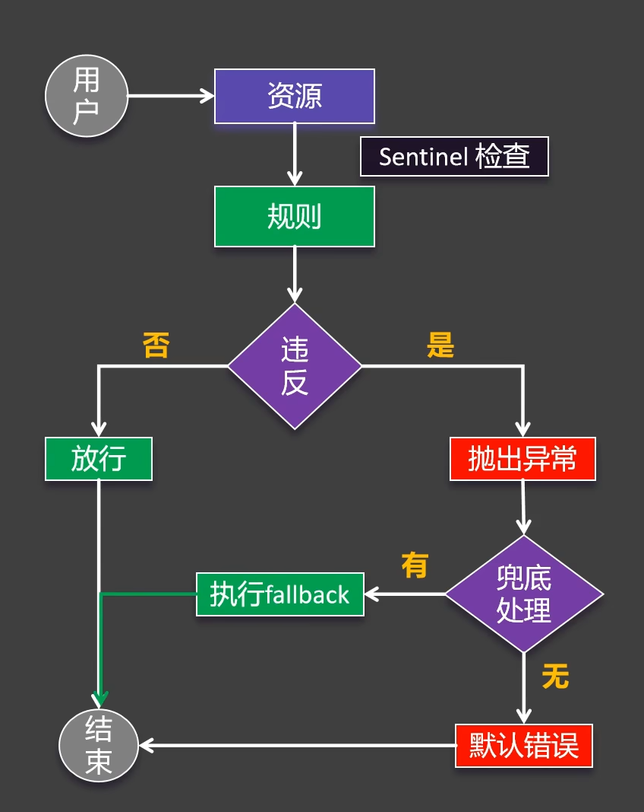
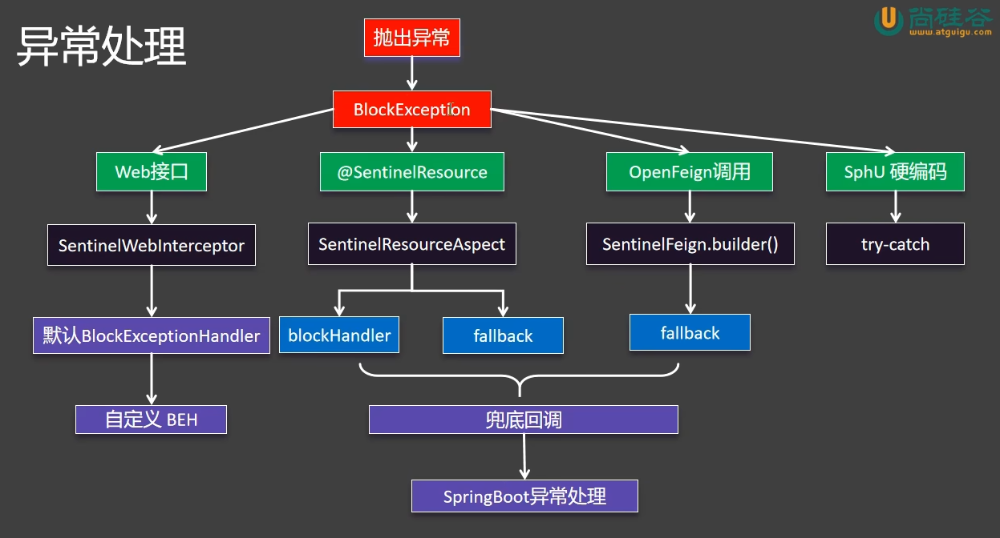
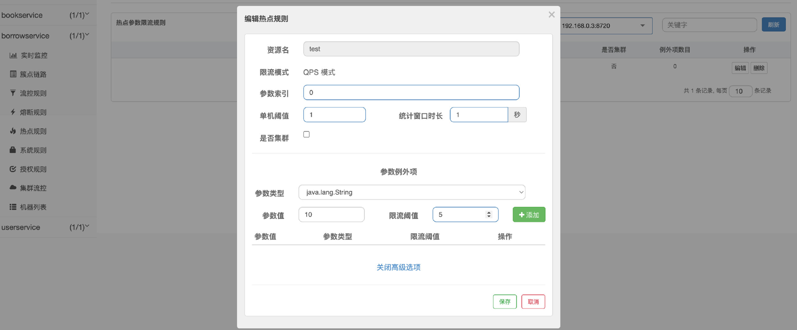
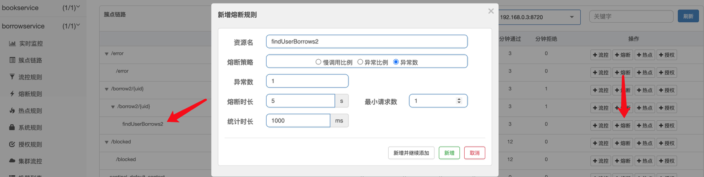

# 部署

[下载地址](https://github.com/alibaba/Sentinel/releases)

下载下来是一个jar包，是一个spring应用，直接jar运行即可，可以添加环境变量`server.port=xxxx`改变端口，用户名密码都是`sentinel`，控制面板地址为`http://your-ip-address:port`

在需要链接到Sentinel的服务中加上依赖

```xml title:pom.xml
<dependency> 
	<groupId>com.alibaba.cloud</groupId> 
	<artifactId>spring-cloud-starter-alibaba-sentinel</artifactId> 
</dependency>
```

并在配置文件中添加

```yml
spring: 
	application: 
		name: userservice 
	cloud: 
		nacos: 
			discovery: 
				server-addr: localhost:8848 
		sentinel: 
			transport: # 添加监控页面地址即可 
				dashboard: localhost:8858
			eager: true # 项目一启动就自动连接到控制台并列出资源而非懒加载
			# 关闭Context收敛，这样被监控方法可以进行不同链路的单独控制
			web-context-unify: false
			# 将请求映射设定为限流页面
			block-page: /blocked
```


# 资源和规则

资源定义：

- 主流框架自动适配（Web Servlet、Dubbo、Spring Cloud、gRPC、Spring WebFlux、Reactor）所有web接口均为资源
- 编程式：SphU API
- 声明式：@SentinelResource（一般标注在非Controller中）

规则定义：

- [流量控制](#流量控制)（FlowRule）
- [熔断降级](服务熔断和降级)（DegradeRule）
- 系统保护（SystemRule）
- 来源访问控制（AuthorityRule）
- 热点参数（ParamFlowRule）


Sentinel的工作流程如下



其中异常处理部分逻辑为




## 流量控制

流量控制有三种模式：
- [直接](#直接流控)
- [关联](#关联流控)
- [链路](#链路流量模式)

### 直接流控
只针对当前资源

### 关联流控
当其他资源超过阈值时， 会导致当前资源被限流。比如说有读写两个资源，现在想要实现在写流量比较大时限制读。这时给读设置关联限流，关联资源设置为写，单机阈值自行指定。这样，当写触发到单机阈值时，读就会被限制。

当系统中出现资源竞争的时候一般设置关联流控。

### 链路流量模式

当从指定资源过来的资源请求达到限流条件时，开启限流
可以对某一个方法进行限流控制，无论是谁在何处调用了它，这里需要使用到`@SentinelResource`，一旦方法被标注，那么就会进行监控，比如这里创建两个请求映射，都来调用Service的被监控方法：

```java title:Controller.java
@RestController 
public class BorrowController { 
	@Resource BorrowService service; 
	
	@RequestMapping("/borrow/{uid}") 
	UserBorrowDetail findUserBorrows(@PathVariable("uid") int uid){ return service.getUserBorrowDetailByUid(uid); } 
	
	@RequestMapping("/borrow2/{uid}") 
	UserBorrowDetail findUserBorrows2(@PathVariable("uid") int uid){ return service.getUserBorrowDetailByUid(uid); } 
}
```
```java title:ServiceImpl.java
@Service 
public class BorrowServiceImpl implements BorrowService{ 
	@Resource BorrowMapper mapper; 
	@Resource UserClient userClient; 
	@Resource BookClient bookClient; 
	
	@Override 
	@SentinelResource("getBorrow") //监控此方法，无论被谁执行都在监控范围内，这里给的value是自定义名称，这个注解可以加在任何方法上，包括Controller中的请求映射方法 
	public UserBorrowDetail getUserBorrowDetailByUid(int uid) { 
		List<Borrow> borrow = mapper.getBorrowsByUid(uid); 
		User user = userClient.getUserById(uid); 
		List<Book> bookList = borrow 
					.stream() 
					.map(b -> bookClient.getBookById(b.getBid())) 
					.collect(Collectors.toList()); 
		return new UserBorrowDetail(user, bookList); 
	} 
}
```

然后我们对`getBorrow`方法配置限流规则，然后将入口资源设置为`/borrow`，这时如果流量是从`/borrow`来就会被限流，从`/borrow2`来就不受限制

### 限流和异常处理

**Web接口限流**

假设此时没有配置`spring.cloud.sentinel.block-page`

然后配置了某个Web接口的限流规则，此时如果触发了限流，就会走异常处理的第一个逻辑，我们可以使用`BlockExceptionHandler`来处理这种异常，例如：

```java
@Component
public class MyBlockExceptionHandler implements BlockExceptionHandler {
    @Resource
    private ObjectMapper mapper;
    
    @Override
    public void handle(HttpServletRequest httpServletRequest,
                       HttpServletResponse httpServletResponse,
                       String s,  // 资源名
                       BlockException e) throws Exception {
        httpServletResponse.setContentType("application/json;charset=UTF-8");
        PrintWriter out = httpServletResponse.getWriter();
        R<String> error = R.error(s + "被限制了，原因为：" + e.getClass());
        out.write(mapper.writeValueAsString(error));
        out.flush();
        out.close();
    }
}
```

**@SentinelResource资源限流**

如果是某个被标注了`@SentinelResource`的资源被限流，需要自定义异常处理，他的默认行为是如果注解中指定了`blockHandler`，则执行指定的方法，否则执行`fallback`的方法，如果`fallback`方法有指定，则执行指定方法，否则执行默认的`fallback`方法，如果默认的`fallback`方法也没有指定，则直接抛出异常。这里用指定`blockHandler`演示

```java
//比如某个@SentinelResource(value = "createOrder", blockHandler = "createOrderFallback")设置了blockHandler
//这里的"createOrderFallback"是个方法名，要求与标注的方法除了方法名其余的全部一致，然后形参多加一个BlockException e用来反映
@SentinelResource(value = "createOrder", blockHandler = "createOrderFallback")
@Override
public Order createOrder(Long productId, Long userId) {
    Product product = productFeignClient.getProductById(productId);
    Order order = new Order();
    order.setId(1L);
    order.setTotalAmount(new BigDecimal("0"));
    order.setUserId(userId);
    order.setNickName("张三");
    order.setAddress("广州");
    order.setProductList(List.of(product));

    return order;
}

// 兜底回调方法
public Order createOrderFallback(Long productId, Long userId, BlockException e) {
    Order order = new Order();
    order.setId(0L);
    order.setTotalAmount(new BigDecimal("0"));
    order.setUserId(userId);
    order.setNickName("未知用户");
    order.setAddress("异常信息" + e.getClass());

    return order;
}
```

注意`blockHandler`只能处理限流情况下抛出的异常，其他不属于限流情况的异常不会处理，但是可以通过其他参数进行处理，如：

```java title:ServiceImpl.java
@RequestMapping("/test") 
@SentinelResource(value = "test", 
				  fallback = "except", //fallback指定出现异常时的替代方案 
				  exceptionsToIgnore = IOException.class) //忽略那些异常，也就是说这些异常出现时不使用替代方案 
String test(){ throw new RuntimeException("HelloWorld！"); } 

//替代方法必须和原方法返回值和参数一致，最后可以添加一个Throwable作为参数接受异常 
String except(Throwable t){ return t.getMessage(); }
```

如果在`@SentinelResource`注解里同时添加`fallback`和`blockHandler`两个参数，则出现限流时走`blockHandler`，因为限流是在方法执行前进行的


假设此时配置了`spring.cloud.sentinel.block-page: /blocked`，则被限流时，会重定向到这个页面

```java Controller.java
@RequestMapping("/blocked") 
JSONObject blocked(){ 
	JSONObject object = new JSONObject(); 
	object.put("code", 403); 
	object.put("success", false); 
	object.put("massage", "您的请求频率过快，请稍后再试！"); 
	return object; 
}
```


**OpenFeign调用限流**

如果是OpenFeign资源被限流了，会走`@FeignClient(name = "service-product", fallback = ProductFeignClientFallback.class)`中`fallback`的指定类中的兜底回调方法。如果没有则会抛出异常让SpringBoot全局异常类自行处理


### 热点参数限流
可以对某一热点数据进行精准限流，比如在某一时刻，不同参数被携带访问的频率是不一样的：
- http://localhost:8301/test?a=10 访问100次
- http://localhost:8301/test?b=10 访问0次
- http://localhost:8301/test?c=10 访问3次
由于携带参数`a`的请求比较多，我们就可以只对携带参数`a`的请求进行限流。
```java title:Controller.java
@RequestMapping("/test") 
@SentinelResource("test") //注意这里需要添加@SentinelResource才可以，用户资源名称就使用这里定义的资源名称 
String findUserBorrows2(@RequestParam(value = "a", required = false) String a, 
						@RequestParam(value = "b", required = false) String b, 
						@RequestParam(value = "c",required = false) String c) { 
	return "请求成功！a = "+a+", b = "+b+", c = "+c; 
}
```
然后在Sentinel里进行热点配置，这里参数`a`的索引为0
在携带参数`a`时，当访问频率超过设定值，就会被限流，这里是直接在后台抛出异常，当不携带参数`a`或者携带其他参数就不会出现限流
除了直接对某个参数精准限流外，还可以对参数携带的指定值单独设定阈值，比如现在不仅希望对参数`a`限流，而且还希望当参数`a`的值为10时，QPS达到5再进行限流，那么就可以设定例外：


## 流控效果

### 快速失败


### Warm Up


### 排队等待


## 服务熔断和降级

如果在某一时刻，服务B出现故障（可能就卡在那里了），而这时服务A依然有大量的请求，在调用服务B，那么，由于服务A没办法再短时间内完成处理，新来的请求就会导致线程数不断地增加，这样，CPU的资源很快就会被耗尽。要防止这种情况，就只能进行隔离了。有两种隔离方案：
- 线程池隔离
- 信号量隔离

**线程池隔离**
线程池隔离实际上就是对每个服务的远程调用单独开放线程池，比如服务A要调用服务B，那么只基于固定数量的线程池，这样即使在短时间内出现大量请求，由于没有线程可以分配，所以就不会导致资源耗尽了

**信号量隔离**
信号量隔离是使用`Semaphore`类实现的，思想基本上与上面是相同的，也是限定指定的线程数量能够同时进行服务调用，但是它相对于线程池隔离，开销会更小一些，使用效果同样优秀，也支持超时等。

Sentinel也正是采用的这种方案实现隔离的。

熔断策略有三种模式：
1、 **慢调用比例：** 如果出现那种半天都处理不完的调用，有可能就是服务出现故障，导致卡顿，这个选项是按照最大响应时间（RT）进行判定，如果一次请求的处理时间超过了指定的RT，那么就被判定为`慢调用`，在一个统计时长内，如果请求数目大于最小请求数目，并且被判定为`慢调用`的请求比例已经超过阈值，将触发熔断。经过熔断时长之后，将会进入到半开状态进行试探（这里和Hystrix一致）
2、**异常比例：** 这个与慢调用比例类似，不过这里判断的是出现异常的次数
3、**异常数：** 这个和上面的唯一区别就是，只要达到指定的异常数量，就熔断

同样的，我们只需要在`@SentinelResource`中配置`blockHandler`参数（如果添加了`@SentinelResource`注解，那么这里会进行方法级别细粒度的限制，和之前方法级别限流一样，会在降级之后直接抛出异常，如果不添加则返回默认的限流页面，`blockHandler`的目的就是处理这种Sentinel机制上的异常，所以这里其实和之前的限流配置是一个道理，因此下面熔断配置也应该对`value`自定义名称的资源进行配置，才能作用到此方法上）：
```java title:Controller.java
@RequestMapping("/borrow2/{uid}") 
@SentinelResource(value = "findUserBorrows2", blockHandler = "test") 
UserBorrowDetail findUserBorrows2(@PathVariable("uid") int uid) { throw new RuntimeException(); } 
UserBorrowDetail test(int uid, BlockException e){ return new UserBorrowDetail(new User(), Collections.emptyList()); }
```
接着对进行熔断配置，注意是对添加的`@SentinelResource`中指定名称的`findUserBorrows2`进行配置


让Frign也支持Sentinel需要在配置文件中开启
```yml title:application.yml
feign:
	sentinel:
		enable: true
```

之后的步骤和[[OpenFeign|OpenFeign]]中的一模一样，也是创建一个实现类

如果用的传统的RestTemplate可以用`@SentinelRestTemplate`注解实现
```java title:config/RestTemplateConfiguration.java
@Bean 
@LoadBalanced 
@SentinelRestTemplate(blockHandler = "handleException", blockHandlerClass = ExceptionUtil.class, fallback = "fallback", fallbackClass = ExceptionUtil.class) //这里同样可以设定fallback等参数 
public RestTemplate restTemplate() { return new RestTemplate(); }
```
