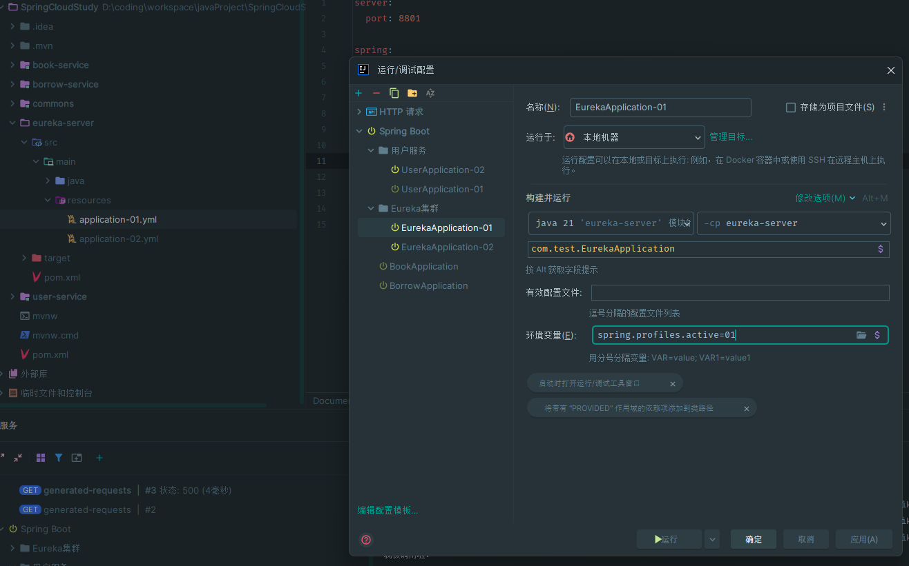

[官方文档](https://docs.spring.io/spring-cloud-netflix/docs/current/reference/html/)
Eureka - 实现服务治理（服务注册与发现），我们可以对所有的微服务进行集中管理，包括他们的运行状态、信息等

在父项目中添加版本管理
```xml title:pom.xml
<dependencyManagement>  
    <dependencies>  
       <dependency>  
          <groupId>org.springframework.cloud</groupId>  
          <artifactId>spring-cloud-dependencies</artifactId>  
          <version>2022.0.3</version>  
       </dependency>  
    </dependencies>  
</dependencyManagement>
```

在eureka-server模块中添加服务端依赖
```xml title:pom.xml
<dependency>  
    <groupId>org.springframework.cloud</groupId>  
    <artifactId>spring-cloud-starter-netflix-eureka-server</artifactId>  
    <version>4.0.2</version>  
</dependency>
```

配置服务端
```yml title:(eureka模块中)application.yml
server:  
  port: 8888  
eureka:  
  client:  
    fetch-registry: false  # 我们是服务端角色，不需要获取服务端
    register-with-eureka: false  # 暂时不需要将自己注册到Eureka，集群才需要
    service-url:  # 服务端指向自己
      defaultZone: http://localhost:8888/eureka
```

在启动类中添加`@EnableEurekaServer`注解


在其他模块中添加客户端依赖并修改配置文件
```xml title:pom.xml
<dependency>  
    <groupId>org.springframework.cloud</groupId>  
    <artifactId>spring-cloud-starter-netflix-eureka-client</artifactId>  
</dependency>
```
```yml title:application.yml
spring:
	application:
		name: XXX
eureka:  
  client:  
    service-url:  
      defaultZone: http://localhost:8888/eureka
```

在调用模块添加configuration
```java title:BeanConfiguration.java
@Configuration  
public class BeanConfiguration {  
    @Bean  
    @LoadBalanced    
    public RestTemplate restTemplate(){  
        return new RestTemplate();  
    }  
}
```

## 配置Eureka集群
创建两个配置文件`application-01.yml` `application-02.yml` 
修改配置文件
```yml title:application-0?.xml
server:  
  port: 8801  
  
spring:  
  application:  
    name: eurekaserver  
  
eureka:  
  instance:  
    hostname: eureka01  
  client:  
    fetch-registry: false  
    # register-with-eureka: false  
    service-url:  
      defaultZone: http://eureka02:8802/eureka # 这里填写其他Eureka服务器的地址
```

由于不认识eureka这个域名，需要到host中配置转发
Linux/Mac: `vim /etc/host`
Windows: `notepad C:\Windows\system32\drivers\etc\hosts`
加上内容
```txt 
127.0.0.1     eureka01
127.0.0.1     eureka02
```

在IDEA编辑启动配置文件


其他服务中配置文件添加上eureka02
```yml title:application.yml
eureka:  
  client:  
    service-url:  
      defaultZone: http://localhost:8801/eureka, http://localhost:8802/eureka
```

调用：
```java title:ServiceImpl.java
@Service  
public class BorrowServiceImpl implements BorrowService {  
    @Resource  
    BorrowMapper mapper;  
  
    @Resource  
    RestTemplate template;  //使用RestTemplate
  
    @Override  
    public UserBorrowDetail getUserBorrowDetailByUid(int uid) {  
        List<Borrow> borrows = mapper.getBorrowsByUid(uid);  
        //通过远程调用获取其他信息  
        User user = template.getForObject("http://userservice/user/" + uid, User.class);  //域名为服务名称
        List<Book> bookList = borrows  
                .stream()  
                .map(b -> template.getForObject("http://bookservice/book/" + b.getId(), Book.class))  //域名为服务名称
                .collect(Collectors.toList());  
        return new UserBorrowDetail(user, bookList);  
    }  
}
```