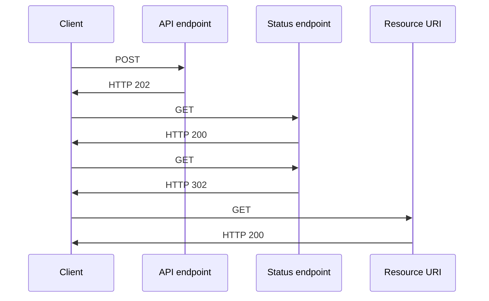

在某些情况下，后端可能需要处理一个超大超长时间的任务。为了解决这个问题，需要使用消息中间件来分离请求和响应阶段。
使用此模式的时机：
- 客户端代码，如浏览器应用程序，其中提供回调端点很困难，或者使用长连接会导致过多额外复杂性
- 只能使用HTTP协议的服务回调，并且由于客户端防火墙限制，返回服务无法触发回调
- 需要与不支持现代回调技术（如WebSockets或webhooks）的遗留架构集成的服务调用


**示例图**



**解决方案：**
1. 客户端应用程序向API发送同步调用，触发后端的长时间运行操作。
2. API应尽快同步响应，返回HTTP 202（已接受）状态码，表示收到请求并正在处理，**注：** 在长时间运行进程前，API应验证请求及其要执行的操作。如果请求无效，应立即返回错误代码，如HTTP 400（请求错误）。
3. 响应中包含一个指向客户端可以轮询以检查长时间运行操作结果的终点位置引用。
4. API将处理任务卸载至另一个组件，比如消息队列。
5. 对于每次成功调用状态端点，它返回HTTP 200状态码。在工作仍在进行时，状态端点返回表示工作正在进行中的资源。一旦工作完成，状态端点可以返回表示已完成的资源，或者重定向至另一个资源的URI。例如：如果异步操作创建了一个新资源，状态端点将重定向到该资源的URI

**处理过程：**
1. 客户端发送请求，并接收到HTTP 202（已接受）响应
2. 客户端向状态断点发送HTTP GET请求。由于正在进行中，所以这次返回HTTP 200状态码
3. 当处理完成后，客户端向状态断点发送HTTP GET请求，由于已经处理结束，后端应返回HTTP 302状态码，并给出资源访问地址
4. 客户端请求资源访问地址，完成本次异步任务

**请求返回值示例：**
客户端提交数据  POST `https://example.com/api/tasks`
```http
HTTP/1.1 202 Accepted
Location: /api/status/482135868
```

如果当客户端向此端点发送GET请求时，响应应包含请求的当前状态。可选地，响应还可以包含预计完成时间或者取消操作的链接
客户端轮询 GET `/api/status/482135868`
```http
HTTP/1.1 200 OK
Content-Type: application/json

{
	"status":"In Progress",
	"link": {
		"rel": "cancel",
		"method": "delete",
		"href": "/api/status/482135868"
	}
}
```

如果异步操作创建了一个新资源，则在操作完成后，状态端点应返回状态码302 Found。在302响应中，应包含一个Location头，给出新资源的URI
```http
HTTP/1.1 302 Found
Location: /api/orders/524694
```

客户端随后访问 GET `/api/orders/524694`，返回任务处理结果