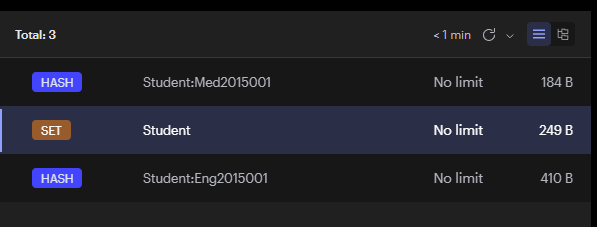

# **安装**
[官网](https://redis.io)  [windows安装版本](https://github.com/tporadowski/redis/releases)
> 先在配置文件注释bind 127.0.0.1，并把protected-mode改为no
# 基本操作
Redis数据库由整数索引标识，默认使用0号数据库，默认有16个，通过`select index`进行切换

添加数据：
```sql
set <key> <value> [EX seconds|PX milliseconds] [数值]; -- 代表多久后过期，不设置则为永久
-- 一次设置多个
mset <key> <value> [<key> <value> ...]
```

存入的数据默认为字符串类型
```sql
-- 使用冒号来进行板块分割，比如下面表示用户XXX的信息中的name属性，值为xxx 
set user:info:用户ID:name xxx
```

取值为`get <key>`

单独设置过期时间
```sql
expire <key> 秒
```

查看离过期时间还剩多少
```sql
ttl <key> -- 秒显示 -1为永久
pttl <key> -- 毫秒显示 
persist <key> -- 转换为永久 
```

删除数据`del <key> ...` 可以删多个

查看所有键`keys *` 后面为模式串

查询键是否存在`exists <key> ...` 这里传入一个键列表，返回存在于这个列表里的键的个数，如有键`a`, `b` 输入`exists a b`返回2，输入`exists a aa` 返回1

随机拿一个键`randomkey`

将一个数据库中的内容移动到另一个数据库中：`move <key> 数据库序号`

修改一个键为另一个键：
```sql
rename <key> <新的名称>
-- 下面这个会检查新的名称是否已经存在
renamenx <key> <新的名称>
```

如果存放的数据是一个数字，可以对其进行自增自减操作：
```sql
-- 等价于a = a + 1
incr <key>
-- 等价于a = a + b
incrby <key> b
-- 等价于a = a - 1
decr <key>
```

查看值的数据类型：
```sql
type <key>
```


# 数据类型
[更多参考](https://www.jianshu.com/p/32b9fe8c20e1)
## Hash
它比较适合存储类这样的数据，由于值本身又是一个Map，因此我们可以在此Map中放入类的各种属性和值，以实现一个Hash数据类型存储一个类的数据。在操作一个Hash时，==实际上就是我们普通操作命令前面添加一个`h`==，这样就能以同样的方式去操作Hash里面存放的键值对了

添加一个Hash类型的数据：
```sql
hset <key> [<字段> <值>]...
```

获取：
```sql
hget <key> <字段>
-- 如果想要一次性获取所有的字段和值
hgetall <key>
```

判断某个字段是否存在：
```sql
hexists <key> <字段>
```

删除Hash中的某个字段：
```sql
hdel <key>
```

Hash中一共存了多少个键值对：
```sql
hlen <key>
```

一次性获取所有字段的值：
```sql
hkeys <key> -- 获取所有键
hvals <key> -- 获取所有值
```

唯一需要注意的是，Hash中只能存放字符串值，不允许出现嵌套的的情况。


## List
双端列表，与LinkedList类似
可以直接向不存在或已存在的List中添加数据，不存在会自动创建
```sql
-- 向列表头部添加元素 
lpush <key> <element>... 
-- 向列表尾部添加元素 
rpush <key> <element>... 
-- 在指定元素前面/后面插入元素 
linsert <key> before/after <指定元素> <element>
```

获取元素：
```sql
-- 根据下标获取元素
lindex <key> <下标>
-- 获取并移除头部元素
lpop <key>
-- 获取并移除尾部元素
rpop <key>
-- 获取指定范围内的
lrange <key> start stop
```
注意下标可以使用负数来表示从后到前数的数字（Python：搁这儿抄呢是吧）:
```sql
-- 获取列表a中的全部元素 
lrange a 0 -1
```

pop和push连用：
```sql
-- 从前一个数组的最后取一个数出来放到另一个数组的头部，并返回元素 
rpoplpush 当前数组 目标数组
```

它还支持阻塞操作，类似于生产者和消费者，比如我们想要等待列表中有了数据后再进行pop操作：
```sql
-- 如果列表中没有元素，那么就等待，如果指定时间（秒）内被添加了数据，那么就执行pop操作，如果超时就作废，支持同时等待多个列表，只要其中一个列表有元素了，那么就能执行
blpop <key>... timeout
```


## Set
向Set中添加一个或多个值：
```sql
sadd <key> <value>...
```

查看Set集合中有多少个值：
```sql
scard <key>
```

判断集合中是否包含：
```sql
-- 是否包含指定值
sismember <key> <value>
-- 列出所有值
smembers <key>
```

集合之间的运算：
```sql
-- 集合之间的差集 key1 - key2
sdiff <key1> <key2>
-- 集合之间的交集
sinter <key1> <key2>
-- 求并集
sunion <key1> <key2>
-- 将集合之间的差集存到目标集合中
sdiffstore 目标 <key1> <key2>
-- 同上
sinterstore 目标 <key1> <key2>
-- 同上
sunionstore 目标 <key1> <key2>
```

移动指定值到另一个集合中：
```sql
smove <key> 目标 value
```

移除操作：
```sql
-- 随机移除一个幸运儿
spop <key>
-- 移除指定
srem <key> <value>...
```


## SortedSet
如果要求Set集合中的数据按照指定的顺序进行排列可以使用SortedSet，它支持为每个值设定一个分数，分数的大小决定了值的位置，所以它是有序的。

添加一个带分数的值：
```sql
zadd <key> [<value> <score>]...
```

同样的：
```sql
-- 查询有多少个值
zcard <key>
-- 移除
zrem <key> <value>...
-- 获取区间内的所有
zrange <key> start stop
```

由于所有的值都有一个分数，我们也可以根据分数段来获取：
```sql
-- 通过分数段查看
zrangebyscore <key> start stop [withscores] [limit]
-- 统计分数段内的数量
zcount <key>  start stop
-- 根据分数获取指定值的排名
zrank <key> <value>
```


## Bitmap
Bitmaps 并不是实际的数据类型，而是定义在String类型上的一个面向字节操作的集合。因为字符串是二进制安全的块，他们的最大长度是512M，最适合设置成2^32个不同字节。

Bitmaps 的最大优势之一在存储信息时极其节约空间。例如，在一个以增量用户ID来标识不同用户的系统中，记录用户的四十亿的一个单独bit信息（例如，要知道用户是否想要接收最新的来信）仅仅使用512M内存。

```sql
set bitmap big  --设置位图大小

SETBIT key offset value --把key这个位图的第offset位设置为value，取值只能为0或1，offset只能为自然数
GETBIT key offset --获取key这个位图指定offset上的二进制位值
BITCOUNT key [start end]  --统计位图中值为1的二进制位数，可以指定被统计的**字节**范围(包含)，不是二进制位偏移量的范围！，start和end可以为负数，规则与python相同
BITPOS key bit [start] [end] --找到key这个位图中，值为bit(0或1)的第一个位置，可以指定搜索范围，若不存在则返回-1

BITOP operation destkey key [key...] --operation的值只能为（AND OR XOR NOT中任意一个）其中AND OR XOR允许用户使用任意数量的位图作为输入，NOT只能允许一个，该命令会将运算结果存储到destkey中，会返回被存储位图的字节长度
```


### 布隆过滤器
布隆过滤器是一个依赖bitmap实现的数据结构，当布隆过滤器为真时不一定为真，但为假时一定为假

使用redisson的`RBloomFilter<String> bloomFilter = redisson.getBloomFilter("name")`，然后使用`bloomFilter.tryInit(expectedInsertions:1000, falseProbability: 0.03);`这里表示预测有1000条数据，容忍的错误率是0.03，底层会自动计算应该设置多长的存储空间
如果只用redis库则可以根据下列函数计算分配空间大小和所需Hash函数个数
```java
private int calculateOptimalSize(int expectedInsertions, //预计插入条数
								 double falseProbability  //容忍错误率
								 ){
	double size = -(expectedInsertions * Math.log(falseProbability)) / Math.pow(Math.log(2), 2);
	return (int) size;  //返回该bitmap最佳空间大小
}

private int calculateOptimalHashFuntions(int expectedInsertions, //预计插入条数
										 int size  //bitmap最佳空间大小
										 ){
	double hashFunctionNum = (size / expectedInsertions) * Math.log(2);
	return (int) Math.ceil(hashFunctionNum);  //返回字符串应使用多少个Hash运算
}
```


#### 利用布隆过滤器解决缓存穿透问题
比如将一个字符串经过n个哈希运算，得到n个数（假设为3），将bitmap对应位数全部设为1，如果此时想要使用数据库某个字段，先根据传入的搜索字符串经过上述哈希运算，得出的3个位置如果上面的值全为1，则认为该字符串是有效的，可以被搜索，否则一律拒绝，这样可以过滤掉一些非法请求，减少不必要的数据库查询


# 持久化

## RDB
```sql
save
-- 注意上面这个命令是直接保存，会占用一定的时间，也可以单独开一个子进程后台执行保存
bgsave
```
可以在配置文件中设置自动保存，并设定在一段时间内写入多少数据时，执行一次保存操作：
```
save 300 10 # 300秒（5分钟）内有10个写入
save 60 10000 # 60秒（1分钟）内有10000个写入
```
配置的save使用的都是bgsave后台执行。


## AOF
保存执行的命令，重启时依次重新执行
有三种保存策略：
- always：每次写操作都会保存一次
- everysec：每秒保存一次
- no：看系统心情

在配置文件中配置：
```sql
# 注意得改成yes
appendonly yes

# appendfsync always
appendfsync everysec
# appendfsync no
```

重启服务器后，可以看到服务器目录下多了一个`appendonly.aof`文件，存储的就是执行的命令。
AOF的缺点也很明显，每次服务器启动都需要进行过程重演，相比RDB更加耗费时间，并且随着操作变多，不断累计，可能到最后aof文件会变得无比巨大，因此需要一个改进方案来优化这些问题。

Redis有一个AOF重写机制进行优化，比如执行了这样的语句：
```
lpush test 666
lpush test 777
lpush test 888
```

实际上用一条语句也可以实现：
```
lpush test 666 777 888
```

正是如此，只要能够保证最终的重演结果和原有语句的结果一致，无论语句如何修改都可以，所以可以通过这种方式将多条语句进行压缩。

输入命令来手动执行重写操作：
```sql
bgrewriteaof
```

或是在配置文件中配置自动重写：
```
# 百分比计算
auto-aof-rewrite-percentage 100
# 当达到这个大小时，触发自动重写
auto-aof-rewrite-min-size 64mb
```

总结：
- AOF：
    - 优点：存储速度快、消耗资源少、支持实时存储
    - 缺点：加载速度慢、数据体积大
- RDB：
    - 优点：加载速度快、数据体积小
    - 缺点：存储速度慢大量消耗资源、会发生数据丢失


# 事务和锁机制
使用命令来直接开启事务：
```sql
multi
```

当输入完所有要执行的命令时，可以使用命令来立即执行事务：
```sql
exec
```

也可以中途取消事务：
```sql
discard
```

实际上整个事务是创建了一个命令队列，它不像MySQL那种在事务中也能单独得到结果，而是提前将所有的命令装在队列中，但是并不会执行，而是等提交事务的时候再统一执行。


# 锁
Redis中可以使用watch来监视一个目标，如果执行事务之前被监视目标发生了修改，则取消本次事务：
```sql
watch <key>

unwatch --取消监视可以使用
```


# Java与Redis交互
```xml title:pom.xml
<dependency>  
    <groupId>redis.clients</groupId>  
    <artifactId>jedis</artifactId>  
    <version>4.4.3</version>  
</dependency>

<!-- springboot用这个 -->
<!-- SpringSession redis支持 -->  
<dependency>  
    <groupId>org.springframework.session</groupId>  
    <artifactId>spring-session-data-redis</artifactId>  
</dependency>  
<!-- Redis的starter -->  
<dependency>  
    <groupId>org.springframework.boot</groupId>  
    <artifactId>spring-boot-starter-data-redis</artifactId>  
</dependency>
```

```yml title:application.yml
spring:
	data:
		redis:
			host: localhost
			port: 6379
			database: 0
```

使用模板：
```java
@Resource
StringRedisTemplate template;

@Test
void contextLoads(){
	template.opsForValue().set("<key>", "<value>");
	//所有类型都包在不同的opsForXXX里面，点开就会用了
	template.delete("<key>");
	//delete方法不在这里面
}
```
也可以使用自定义的
```java
@Autowired 
StringRedisTemplate template; 

@Test 
void contextLoads() { 
	ValueOperations<String, String> operations = template.opsForValue(); 
	operations.set("c", "xxxxx"); //设置值 
	System.out.println(operations.get("c")); //获取值 
	template.delete("c"); //删除键 
	System.out.println(template.hasKey("c")); //判断是否包含键 
}
```
所有的值的操作都被封装到了`ValueOperations`对象中，而普通的键操作直接通过模板对象就可以使用了


# 像MyBatis一样操作Redis复杂数据
用到的依赖也就是上面的`spring-boot-starter-data-redis`，如上配置好之后
例如这个实体类：
```java title:Student.java
@Data  
@RedisHash("Student")  //声明一个入口，key为Student
@NoArgsConstructor  
public class Student implements Serializable {  
    public enum Gender{  
        MALE,FEMALE;  
    }  
  
    @Id  //以及这个Id
    private String id;  
    private String name;  
    private Gender gender;  
    private Integer grade;  
    private List<Book> books = new ArrayList<>();  
  
    public Student(String id, String name, Gender gender, Integer grade) {  
        this.id = id;  
        this.name = name;  
        this.gender = gender;  
        this.grade = grade;  
    }  
}
```

并定义`StudentRepository`接口
```java title:StudentRepository.java
@Repository  
public interface StudentRepository extends CrudRepository<Student, String> {  
}
```
其实这个时候就已经可以使用了，因为运行时SpringData会自动生成`StudentRepository`的实现类并进行实例化放到IOC容器中，`CrudRepository`实现了很多常用方法。
还可以实现`CrudRepository`用来以名称模板生成方法
```java title:StudentRepository.java
public interface StudentRepository extends CrudRepository<Student, String> , QueryByExampleExecutor<Student> {  
    List<Student> findByName(String name);  
}
```
使用：
```java title:Tests.java
@Resource  
StudentRepository studentRepository;  
  
@BeforeEach  
public void init(){  
    Student engStudent = new Student("Eng2015001", "John Doe", Student.Gender.MALE, 1);  
    engStudent.getBooks().add(new Book("Java", "Java is a programming language"));  
    engStudent.getBooks().add(new Book("Python", "Java is a programming language"));  
    engStudent.getBooks().add(new Book("C++", "Java is a programming language"));  
  
    Student medStudent = new Student("Med2015001", "Gareth Houston", Student.Gender.MALE, 2);  
  
    studentRepository.save(engStudent);  
    studentRepository.save(medStudent);  
}  
  
//@AfterEach  
public void destroy(){  
    studentRepository.deleteById("Eng2015001");  
    studentRepository.deleteById("Med2015001");  
}

@Test  
public void update(){  
    Student retrieveStudent = studentRepository.findById("Eng2015001").get();  
    retrieveStudent.setGrade(2);  
    studentRepository.save(retrieveStudent);  
    System.out.println(studentRepository.findById("Eng2015001").get());  
}  
  
@Test  
public void query(){  
    Iterable<Student> students = studentRepository.findAll();  
    students.forEach(System.out::println);  
}
```
表中数据长这样



# 以注解方式实现方法结果缓存
依赖：
```xml
<!--redis-->  
<dependency>  
    <groupId>org.springframework.boot</groupId>  
    <artifactId>spring-boot-starter-data-redis</artifactId>  
</dependency>  
<!-- cache -->  
<dependency>  
    <groupId>org.springframework.boot</groupId>  
    <artifactId>spring-boot-starter-cache</artifactId>  
</dependency>
```
配置Redis的序列化器：
```java
@Configuration  
public class RedisConfig {  
  
    @Bean  
    public RedisCacheConfiguration redisCacheConfiguration() {  
        RedisCacheConfiguration config = RedisCacheConfiguration.defaultCacheConfig();  
        // 设置序列化方式  
        config = config.serializeValuesWith(RedisSerializationContext.SerializationPair.fromSerializer(RedisSerializer.json()));  
        return config;  
    }  
}
```
开启Cache，此处还可以配置CacheManager
```java
@Configuration  
@EnableCaching  
public class CacheConfig {  
}
```
在ServiceImpl中使用注解即可，例如：
```java
@Service  
@CacheConfig(cacheNames = "org.example.springbootstudy.service.impl.TestServiceImpl") // 相当于给定命名空间，命名隔离  
public class UserServiceImpl extends ServiceImpl<UserMapper, User> implements UserService {

	@Override  
	// @CachePut(key = "#user.id")  // 一般用在添加和更新方法上，key为了唯一性，一般用对象的主键，但是只插入会有问题，插入后userAll就不匹配了  
	@Caching(   // 这个注解可以包含多个缓存操作  
	    put = @CachePut(key = "#user.id"),  // 添加这个User  
	    evict = @CacheEvict(key = "'userAll'")  
	)  
	public User saveUser(User user) {  
	    userMapper.insert(user);  
	    return user;  
	}
}
```
在Redis中保存的key为`org.example.springbootstudy.service.impl.TestServiceImpl::1`，值格式为：
```json
{
	"@class":"org.example.springbootstudy.entity.User",
	"id":1,
	"name":"jiemoo"
}
```
具体注解的使用可以在Caffeine笔记中查询


# 事务操作
由于Spring没有专门的Redis事务管理器，所以只能借用JDBC提供的
```xml
<dependency>
    <groupId>org.springframework.boot</groupId>
    <artifactId>spring-boot-starter-jdbc</artifactId>
</dependency>
<dependency>
    <groupId>mysql</groupId>
    <artifactId>mysql-connector-java</artifactId>
</dependency>
<dependency>
    <groupId>com.fasterxml.jackson.core</groupId>
    <artifactId>jackson-databind</artifactId>
</dependency>

```
```java
@Service
public class RedisService {

    @Resource
    //StringRedisTemplate template;
    RedisTemplate<Object, Object> template;

    @PostConstruct
    public void init(){
        template.setEnableTransactionSupport(true);   //需要开启事务
        tempalte.setValueSerializer(new Jackson2JsonRedisSerializer<>(Object.class)); //使用Jackson作为序列化器，否则就需要在实体类上实现Serializable
    }

    @Transactional    //需要添加此注解
    public void test(){
        template.multi();
        template.opsForValue().set("d", "xxxxx");
        template.exec();
    }
}
```

为RedisTemplate对象配置一个Serializer来实现对象的JSON存储：
```java
@Test
void contextLoad2() {
    //注意Student需要实现序列化接口才能存入Redis
    template.opsForValue().set("student", new Student());
    System.out.println(template.opsForValue().get("student"));
}
```


# 分布式锁
超售问题
Redis存在一个命令`setnx key value`他的意思是set if not exists，利用这个机制实现类似信号量就能控制分布式事务执行，还可以加一个过期时间`set key value EX|PX n NX` 这里用set命令后面的NX就是使用setnx模式
单纯只是添加过期时间，会出现这种把别人加的锁谁卸了的情况，要解决这种问题也很简单，现在的目标就是保证任务只能删除自己加的锁，如果是别人加的锁是没有资格删的，所以可以把a的值指定为任务专属的值，比如可以使用UUID之类的，如果在主动删除锁的时候发现值不是当前任务指定的，那么说明可能是因为超时，其他任务已经加锁了。

但是这里还有一个问题，假设就在超时前一瞬间获取a，发现一致，可以删除，但是a超时被删了此时又会删除了别人的值，要解决这个问题可以借助Redisson框架，他是Redis官方推荐的Java版的客户端。它提供一个监控锁的看门狗，作用是在Redisson示例被关闭前，不断延长锁的有效期。
```xml
<dependency> 
	<groupId>org.redisson</groupId> 
	<artifactId>redisson</artifactId> 
	<version>3.17.0</version> 
</dependency> 
<dependency> 
	<groupId>io.netty</groupId> 
	<artifactId>netty-all</artifactId> 
	<version>4.1.75.Final</version> 
</dependency>
```
使用时：
```java
public static void main(String[] args) { 
	Config config = new Config(); 
	config.useSingleServer().setAddress("redis://192.168.0.10:6379"); //配置连接的Redis服务器，也可以指定集群 
	RedissonClient client = Redisson.create(config); //创建RedissonClient客户端 
	for (int i = 0; i < 10; i++) { 
		new Thread(() -> { 
			try(Jedis jedis = new Jedis("192.168.0.10", 6379)){ 
				RLock lock = client.getLock("testLock"); //指定锁的名称，拿到锁对象 
				for (int j = 0; j < 100; j++) { 
					lock.lock(); //加锁 
					int a = Integer.parseInt(jedis.get("a")) + 1; 
					jedis.set("a", a+""); 
					lock.unlock(); //解锁 
				} 
			} 
			System.out.println("结束！"); 
		}).start(); 
	} 
}
```
但是如果是Redis分布式集群里面有一个服务器挂掉了，这里获取不到锁就麻烦了。所以可以使用RedLock，要超过半数的实例获取锁成功后才真正获取到锁。但是RedLock也有几个大的问题：
1. 客户端无法感知锁失效。
2. RedLock过于依赖时钟。
如果数据一致性要求比较严格，那么建议用Zookeeper实现分布式锁。

# 用Redis做二级缓存
## MyBatis二级缓存
将Redis作为Mybatis的二级缓存，这样就能实现多台服务器使用同一个二级缓存，因为它们只需要连接同一个Redis服务器即可，所有的缓存数据全部存储在Redis服务器上。需要手动实现Mybatis提供的Cache接口
```java
//实现Mybatis的Cache接口
public class RedisMybatisCache implements Cache {

    private final String id;
    private static RedisTemplate<Object, Object> template;

   	//注意构造方法必须带一个String类型的参数接收id
    public RedisMybatisCache(String id){
        this.id = id;
    }

  	//初始化时通过配置类将RedisTemplate给过来
    public static void setTemplate(RedisTemplate<Object, Object> template) {
        RedisMybatisCache.template = template;
    }

    @Override
    public String getId() {
        return id;
    }

    @Override
    public void putObject(Object o, Object o1) {
      	//这里直接向Redis数据库中丢数据即可，o就是Key，o1就是Value，60秒为过期时间
        template.opsForValue().set(o, o1, 60, TimeUnit.SECONDS);
    }

    @Override
    public Object getObject(Object o) {
      	//这里根据Key直接从Redis数据库中获取值即可
        return template.opsForValue().get(o);
    }

    @Override
    public Object removeObject(Object o) {
      	//根据Key删除
        return template.delete(o);
    }

    @Override
    public void clear() {
      	//由于template中没封装清除操作，只能通过connection来执行
				template.execute((RedisCallback<Void>) connection -> {
          	//通过connection对象执行清空操作
            connection.flushDb();
            return null;
        });
    }

    @Override
    public int getSize() {
      	//这里也是使用connection对象来获取当前的Key数量
        return template.execute(RedisServerCommands::dbSize).intValue();
    }
}
```

配置类：
```java
@Configuration
public class MainConfiguration {
    @Resource
    RedisTemplate<Object, Object> template;

    @PostConstruct
    public void init(){
      	//把RedisTemplate给到RedisMybatisCache
        RedisMybatisCache.setTemplate(template);
    }
}
```

在Mapper上启用此缓存：
```java
//只需要修改缓存实现类implementation为我们的RedisMybatisCache即可
@CacheNamespace(implementation = RedisMybatisCache.class)
@Mapper
public interface MainMapper {

    @Select("select name from student where sid = 1")
    String getSid();
}
```

## Token持久化
```java
//实现PersistentTokenRepository接口
@Component
public class RedisTokenRepository implements PersistentTokenRepository {
  	//Key名称前缀，用于区分
    private final static String REMEMBER_ME_KEY = "spring:security:rememberMe:";
    @Resource
    RedisTemplate<Object, Object> template;

    @Override
    public void createNewToken(PersistentRememberMeToken token) {
      	//这里要放两个，一个存seriesId->Token，一个存username->seriesId，因为删除时是通过username删除
        template.opsForValue().set(REMEMBER_ME_KEY+"username:"+token.getUsername(), token.getSeries());
        template.expire(REMEMBER_ME_KEY+"username:"+token.getUsername(), 1, TimeUnit.DAYS);
        this.setToken(token);
    }

  	//先获取，然后修改创建一个新的，再放入
    @Override
    public void updateToken(String series, String tokenValue, Date lastUsed) {
        PersistentRememberMeToken token = this.getToken(series);
        if(token != null)
           this.setToken(new PersistentRememberMeToken(token.getUsername(), series, tokenValue, lastUsed));
    }

    @Override
    public PersistentRememberMeToken getTokenForSeries(String seriesId) {
        return this.getToken(seriesId);
    }

  	//通过username找seriesId直接删除这两个
    @Override
    public void removeUserTokens(String username) {
        String series = (String) template.opsForValue().get(REMEMBER_ME_KEY+"username:"+username);
        template.delete(REMEMBER_ME_KEY+series);
        template.delete(REMEMBER_ME_KEY+"username:"+username);
    }

  
  	//由于PersistentRememberMeToken没实现序列化接口，这里只能用Hash来存储了，所以单独编写一个set和get操作
    private PersistentRememberMeToken getToken(String series){
        Map<Object, Object> map = template.opsForHash().entries(REMEMBER_ME_KEY+series);
        if(map.isEmpty()) return null;
        return new PersistentRememberMeToken(
                (String) map.get("username"),
                (String) map.get("series"),
                (String) map.get("tokenValue"),
                new Date(Long.parseLong((String) map.get("date"))));
    }

    private void setToken(PersistentRememberMeToken token){
        Map<String, String> map = new HashMap<>();
        map.put("username", token.getUsername());
        map.put("series", token.getSeries());
        map.put("tokenValue", token.getTokenValue());
        map.put("date", ""+token.getDate().getTime());
        template.opsForHash().putAll(REMEMBER_ME_KEY+token.getSeries(), map);
        template.expire(REMEMBER_ME_KEY+token.getSeries(), 1, TimeUnit.DAYS);
    }
}
```

验证Service：
```java
@Service
public class AuthService implements UserDetailsService {

    @Resource
    UserMapper mapper;

    @Override
    public UserDetails loadUserByUsername(String username) throws UsernameNotFoundException {
        Account account = mapper.getAccountByUsername(username);
        if(account == null) throw new UsernameNotFoundException("");
        return User
                .withUsername(username)
                .password(account.getPassword())
                .roles(account.getRole())
                .build();
    }
}
```

Mapper：
```java
@Data
public class Account implements Serializable {
    int id;
    String username;
    String password;
    String role;
}
```

```java
@CacheNamespace(implementation = MybatisRedisCache.class)
@Mapper
public interface UserMapper {

    @Select("select * from users where username = #{username}")
    Account getAccountByUsername(String username);
}
```

配置文件：
```java
@Override
protected void configure(HttpSecurity http) throws Exception {
    http
            .authorizeRequests()
            .anyRequest().authenticated()
            .and()
            .formLogin()
            .and()
            .rememberMe()
            .tokenRepository(repository);
}

@Override
protected void configure(AuthenticationManagerBuilder auth) throws Exception {
    auth
            .userDetailsService(service)
            .passwordEncoder(new BCryptPasswordEncoder());
}
```


# 主从复制
假设主节点端口号为`6001`，从节点端口号为`6002`，启动两个Redis服务器
输入`info replication`命令查看当前的主从状态，可以看到默认角色为：Master，也就是说所有服务器在启动之后都是主节点的状态。
现在希望让`6002`作为从节点，只需要在`6002`上输入一个命令`replicaof x.x.x.x 6001`，此时再查看信息已经变成了从服务器。
取消从节点的Slave角色：`replicaof no one`

**偏移量**
主从服务器分别会维护自己的一个复制偏移量，主服务器每次向从服务器中传递N个字节时，会将自己的复制偏移量加上N。从服务器中受到主服务器的N个字节的数据，就会将自己的复制偏移量加上N，通过偏移量对比就可以很方便地看出来主从服务器数据是否一致，如果不一致则需要进行增量同步。

**同步流程**
1. 从节点执行`replicaof ip port`命令后，从节点会保存主节点相关的地址信息
2. 从节点通过每秒运行的定时任务发现配置了新的主节点后，会尝试与该结点建立网络连接，专门用于接收主节点发送的复制命令
3. 连接成功后第一次进行全量复制，之后使用增量复制

主节点down掉后从节点依然可以读取数据但是会一直报错
每次添加从节点时都要敲命令太麻烦了，可以直接在配置文件中增加一行`replicaof ip port`就行

# 哨兵模式
[更多资料](https://blog.csdn.net/wzngzaixiaomantou/article/details/126089156)
哨兵模式默认端口为`26379`
将一个Redis服务器作为哨兵启动，在配置文件删掉全部内容，并添加
```
sentinel monitor 监控服务名称 主节点ip 主节点port quorum
```
启动：`redis-server 配置文件 --sentinel`
配置文件会自动生成一个，此时再把`protected-mode`改为`no`
`quorum`值代表有几个哨兵认为主节点挂了就重新选举新的主节点

## 故障处理
1. 主库下线判定
	1. 主观下线
			主观下线适用于所有**主节点**和**从节点**，如果最后一次有效回复PING命令的时间超过`down-after-milliseconds`毫秒，则会判定该节点为==主观下线（SDOWN）==
	        注意：**主从节点**都可能被标记为主观下线，只不过只会对**主节点**的客观下线进行下一步判断。在一般情况下， 每个 Sentinel 会以每 10 秒一次的频率，向它已知的所有 主服务器 和 从服务器 发送 INFO 命令。当一个 主服务器 被 Sentinel 标记为 客观下线 时，Sentinel 向 下线主服务器 的所有 从服务器 发送 INFO 命令的频率，会从 10 秒一次改为 每秒一次。
	2. 客观下线
	        客观下线只适用于**主节点**。当 Sentinel 将一个主服务器判断为主管下线后，为了确认这个主服务器是否真的下线，会向同样监视这一主服务器的其他 Sentinel 询问（ 通过`sentinel is-master-down-by-addr`指令判断），看它们是否也认为主服务器已经下线。
	        其他哨兵会根据自己和主库的连接情况，做出 Y 或 N 的响应，Y 相当于赞成票，N 相当于反对票。如果赞成票数（这里是2）是大于等于哨兵配置文件中的 quorum 配置项（比如quorum=2）, 则可以判定主库客观下线了。当足够数量的 Sentinel 认为主服务器已下线，就判定其为客观下线（ODOWN），并对其执行故障转移操作。
2. 哨兵集群的选举
	当一个主服务器被判断为客观下线时，监视这个下线主服务器的各个 Sentinel 会进行选举，选举出一个领头的 Sentinel，并由领头 Sentinel 对下线主服务器执行故障转移操作。
	哨兵的选举机制使用[Raft选举算法](https://zhuanlan.zhihu.com/p/32052223 "（Raft算法详解）")每个发现服务客观下线的sentinel，都会要求其他sentinel将自己设置成领头。所有的sentinel都有且只有一次将某个sentinel选举成领头的机会（在一轮选举中），一旦选举某个sentinel为领头，不能更改。领头sentinel是先到先得，一旦当前sentinel设置了领头sentinel，以后要求设置sentinel为领头请求都会被拒绝。
	成为领头sentinel的条件如下：
	- 拿到半数以上的赞成票
	- 拿到的票数还需大于quorum值
3. 新主库的选出
	主库被判定为客观下线后，就需要从剩余的从库中选择一个新的主库。
	-  过滤列表中所有处于下线或断线状态的从服务器。
	- 过滤列表中所有最近五秒没有回复过 Sentinel Leader 的 INFO 命令的从服务器。
	- 过滤所有与已下线主服务器连接断开超过 down-after-milliseconds * 10 毫秒的从服务器（down-after-milliseconds 指定了判断主服务器下线所需的时间）。
	然后新的Leader根据以下规则选举出新的主服务器
	1. 首先会根据优先级选择，在配置文件中配置添加`replica-priority`配置项（默认值100），越小优先级越高
	2. 如果优先级一样选择**偏移量**最大的
	3. 还选择不出来就选择`runid`（启动时随机生成）最小的

最后，需要注意的是，主从切换并不一定就能完成，下面举个例子，Redis 1主4从，5个哨兵，哨兵配置quorum为2，如果3个哨兵故障，此时主节点宕机。由于quorum=2，所以当一个哨兵判断主库“主观下线”后，询问另外一个哨兵后也会得到同样的结果，2个哨兵都判定“主观下线”，达到了quorum的值，因此，哨兵集群可以判定主库为“客观下线”。但哨兵不能完成主从切换。哨兵标记主库“客观下线后”，在选举“哨兵领导者”时，一个哨兵必须拿到超过多数的选票(5/2+1=3票)。但目前只有2个哨兵活着，无论怎么投票，一个哨兵最多只能拿到2票，永远无法达到N/2+1选票的结果。当没有足够数量的 Sentinel 同意 主服务器 下线时， 主服务器 的 客观下线状态 就会被移除。当 主服务器 重新向 Sentinel 的 PING 命令返回 有效回复 时，主服务器 的 主观下线状态 就会被移除。同样，从服务器的主观下线状态在PING命令得到有效回复后移除。

## 数据丢失问题（无解）
### 1. 异步复制导致的数据丢失
因为 master->slave 的复制是异步的，所以可能有部分数据还没复制到 slave，master 就宕机了，此时这部分数据就丢失了。

### 2. 脑裂导致的数据丢失
即一个主从关系中出现了2个主节点，例如某个 master 所在机器突然脱离了正常的网络，跟其他 slave 机器不能连接，但是实际上 master 还运行着。此时哨兵可能就会认为 master 宕机了，然后开启选举，将其他 slave 切换成了 master。这个时候，集群里就会有两个 master ，也就是所谓的脑裂。
此时虽然某个 slave 被切换成了 master，但是可能 client 还没来得及切换到新的 master，还继续向旧 master 写数据。因此旧 master 再次恢复的时候，会被作为一个 slave 挂到新的 master 上去，自己的数据会清空，重新从新的 master 复制数据。而新的 master 并没有后来 client 写入的数据，因此，这部分数据也就丢失了。

### 解决方案
对主节点的写入数据条件进行一定限制
```
min-slaves-to-write 3
min-slaves-max-lag 10
```
当从服务器小于 3 个，或三个从服务器的延迟（lag）都大于等于 10 秒时，主服务器将拒绝执行写命令，直至故障恢复。通过对主节点进行限制，能够保证当主节点挂机后丢失的数据尽量少。


# 集群模式
本质是多组的主从节点，多主多从，主要用于解决写能力瓶颈
集群模式使用哈希槽的方法进行数据分片，数据集被划分为16384个槽位，编号为0~16383。集群的每个主从结点负责一部分的哈希槽，当存储某个key时，通过CRC16算法进行Hash计算获得一个值决定放在哪个槽位
集群至少需要3组主从节点
集群是否完成才能对外提供服务的配置为`cluster-require-full-coverage yes`建议设置为no
取消`cluster-enable yes`注释，输入`redis-cli --cluster create --cluster-replicas N M1:port M2:port M3:port S1:port S2:port S3:port`
其中`--cluster-replicas N`指每个主节点分配多少个从节点

当启用集群后，连接命令行时可以加上`-c`表示以集群模式访问，此时再插入数据会自动转到对应能插入的主机插入数据，不会再报错
输入`cluster nodes`查看集群信息


# 数据一致性问题
先操作缓存时一般采用**延迟双删**：
1. 先删除缓存
2. 写数据库
3. 休眠XX毫秒，再次删除缓存
这样最多其他线程在这XX毫秒的脏数据读取时间。这个时间需要评估项目的读取业务逻辑的耗时（即线程二从数据库读取数据 写入缓存完成），防止线程二覆盖掉新的数据，这样只能保证数据的最终一致性，不能保证强一致性，但是AP和CP不可兼得，要保证强一致性必须加锁，这样性能就会下降

若先操作数据库，有可能会出现修改数据库后删除缓存失败的极端情况
使用Canal进行异步删除的解耦，Canal相当于一个从库，监听主库的binlog，专门部署一个Springboot应用作为Canal客户端，把重试删除的代码放在这里
操作步骤：
1. 修改数据库
2. 删除缓存（假设此时删除失败）
3. Canal监听到数据库数据发生变动，将更新的数据通知Canal客户端
4. Canal客户端执行延迟删除Redis
5. 如果删除失败，发送一条包含需要删除的Key的消息到MQ
6. MQ再次通知Canal执行删除重试


